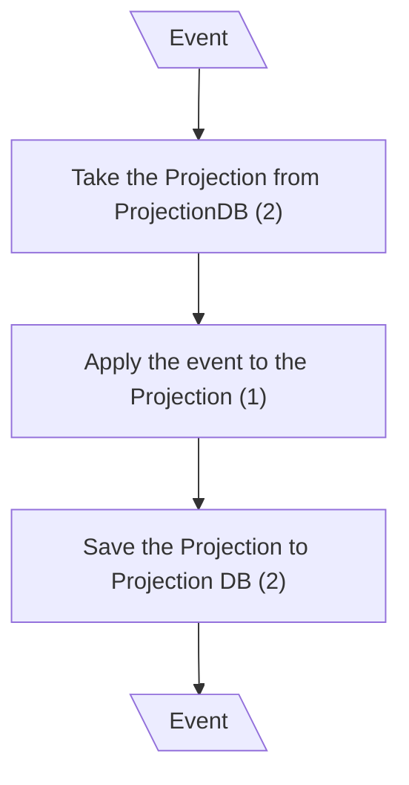
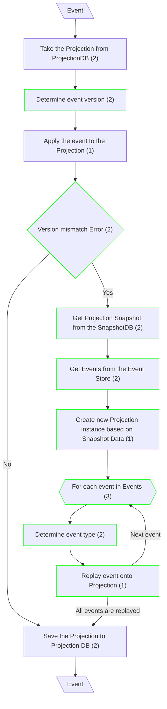

# Eventual Consistency

## Handle Event - Update Projection (Canonical CQRS)

## Handle Event - Update Projection (Classical CQRS)

**Input/Output Parameters:** Event (1)

| ID    | Name                                                  | Type          | Weight |
|-------|-------------------------------------------------------|---------------|--------|
| BCS1  | Determine event version                               | branch        | 2      |
| BCS2  | Version mismatch Error                                | branch        | 2      |
| BCS3  | Get Projection Snapshot from the SnapshotDB           | function call | 2      |
| BCS4  | Get Events from the Event Store                       | function call | 2      |
| BCS5  | Create new Projection instance based on Snapshot Data | sequence      | 1      |
| BCS6  | For each event in Events                              | iteration     | 3      |
| BCS7  | Determine event type                                  | branch        | 2      |
| BCS8  | Replay event onto Projection                          | sequence      | 1      |
| Total |                                                       |               | 15     |

**Migration Complexity:** 1 × 15 = **15**  

---

## Total

15
