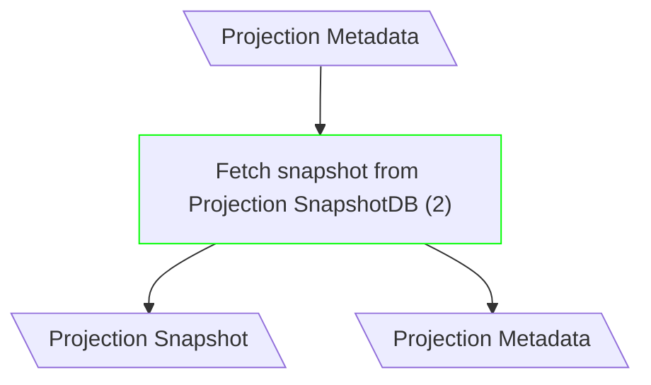
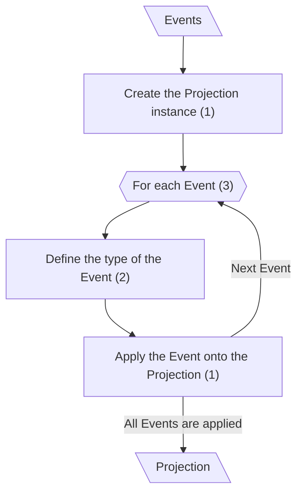
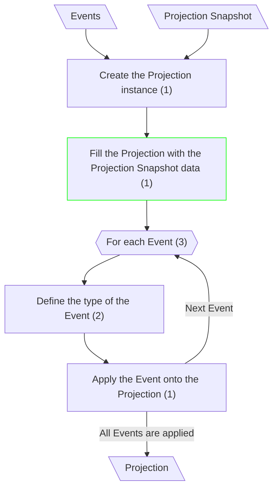
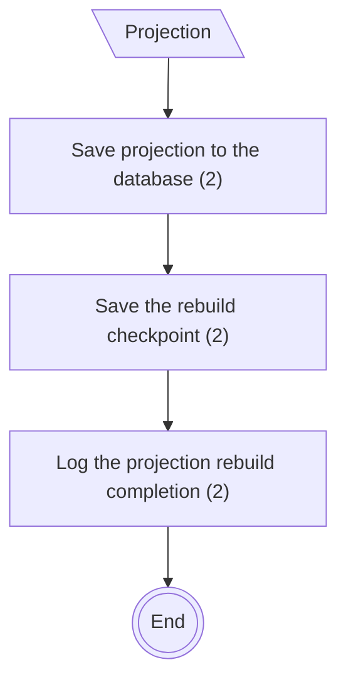
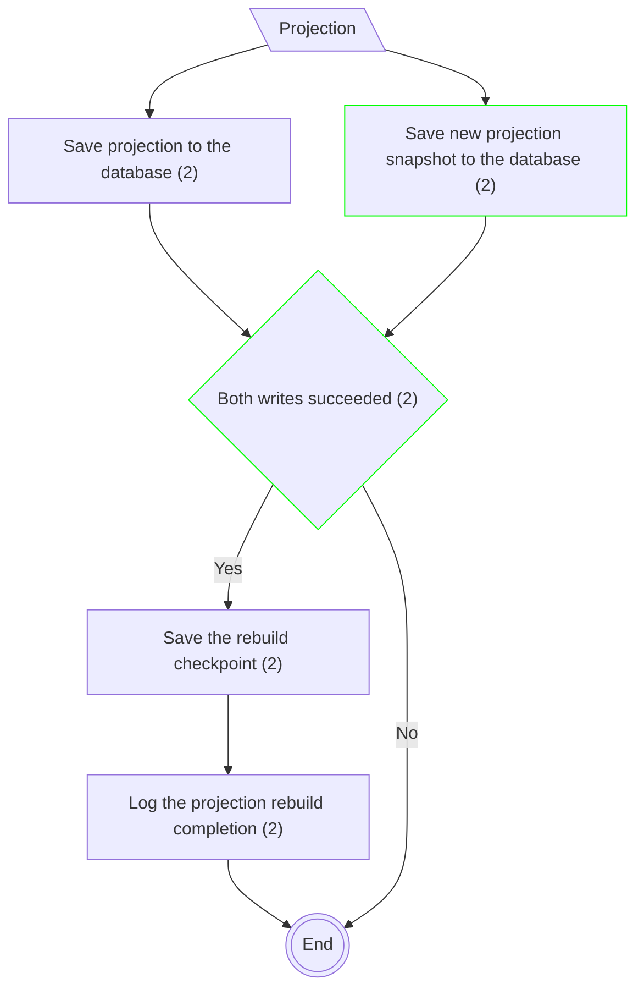

# Projection Rebuild

## Fetch Snapshot (Classical CQRS)

**Input/Output Parameters:** Projection Metadata, Projection Snapshot (2)

| ID    | Name                                      | Type          | Weight |
|-------|-------------------------------------------|---------------|--------|
| BCS1  | Fetch snapshot from Projection SnapshotDB | function call | 2      |
| Total |                                           |               | 2      |

**Migration Complexity:** 2 × 2 = **4**  

---

## Build New Projection (Canonical CQRS)

## Build New Projection (Classical CQRS)

**Input/Output Parameters:** Events, Projection Snapshot, Projection (3)

| ID    | Name                                                  | Type     | Weight |
|-------|-------------------------------------------------------|----------|--------|
| BCS1  | Fill the Projection with the Projection Snapshot data | sequence | 1      |
| Total |                                                       |          | 1      |

**Migration Complexity:** 3 × 1 = **3**  

---

## Save Projection (Canonical CQRS)

## Save Projection (Classical CQRS)

**Input/Output Parameters:** Projection (1)

| ID    | Name                                         | Type          | Weight |
|-------|----------------------------------------------|---------------|--------|
| BCS1  | Save new projection snapshot to the database | function call | 2      |
| BCS2  | Both writes succeeded                        | branch        | 2      |
| Total |                                              |               | 4      |

**Migration Complexity:** 1 × 4 = **4**  

---

## Total

4 + 3 + 4 = 11
