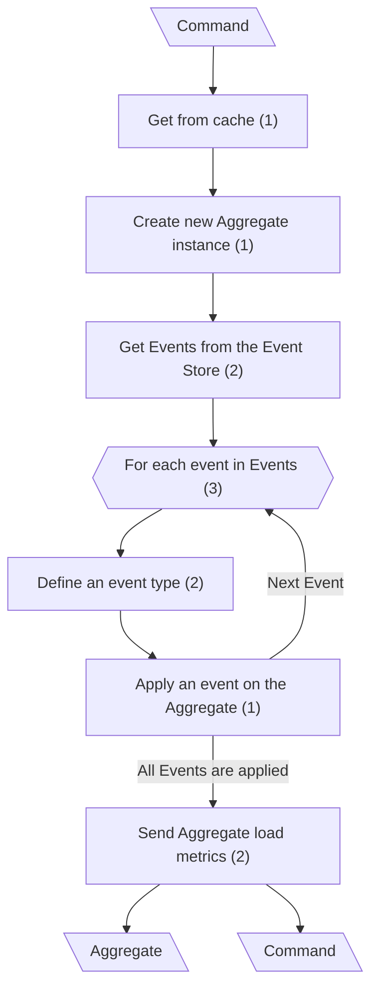
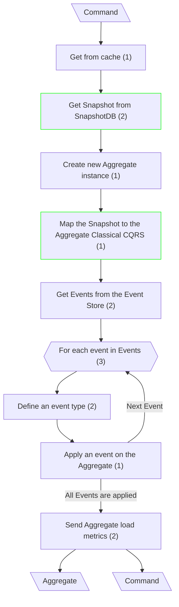
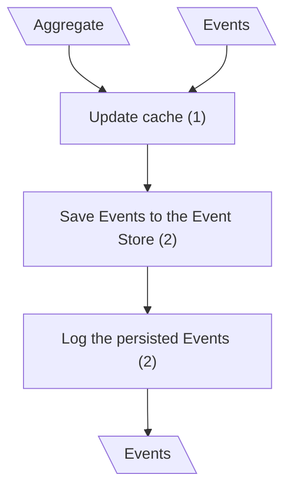
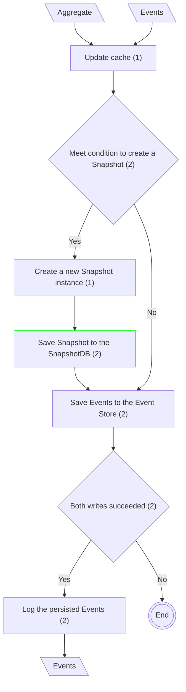

# Update Entity

## Fetch the Aggregate (Canonical CQRS)

## Fetch the Aggregate (Classical CQRS)

**Input/Output Parameters:** Command, Aggregate (2)

| ID    | Name                                             | Type          | Weight |
|-------|--------------------------------------------------|---------------|--------|
| BCS1  | Get Snapshot from SnapshotDB                     | function call | 2      |
| BCS2  | Map the Snapshot to the Aggregate Classical CQRS | sequence      | 1      |
| Total |                                                  |               | 3      |

**Migration Complexity:** 2 × 3 = **6**  

---

## Save Aggregate (Canonical CQRS)

## Save Aggregate (Classical CQRS)

**Input/Output Parameters:** Aggregate, Events (2)

| ID    | Name                                | Type          | Weight |
|-------|-------------------------------------|---------------|--------|
| BCS1  | Meet condition to create a Snapshot | branch        | 2      |
| BCS2  | Create a new Snapshot instance      | sequence      | 1      |
| BCS3  | Save Snapshot to the SnapshotDB     | function call | 2      |
| BCS4  | Both writes succeeded               | branch        | 2      |
| Total |                                     |               | 7      |

**Migration Complexity:** 2 × 7 = **14**  

---

## Total

6 + 14 = 20
