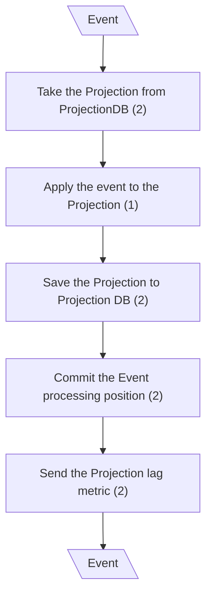
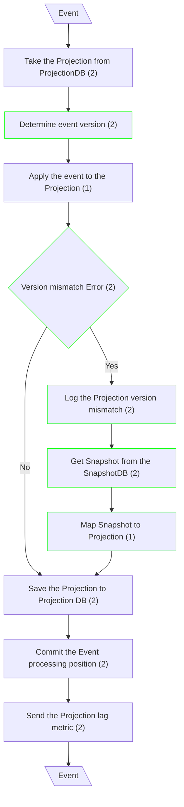

# Eventual Consistency

## Handle Event - Update Projection (Canonical CQRS)

## Handle Event - Update Projection (mCQRS)

**Input/Output Parameters:** Event (1)

| ID    | Name                                | Type          | Weight |
|-------|-------------------------------------|---------------|--------|
| BCS1  | Determine event version             | branch        | 2      |
| BCS2  | Version mismatch Error              | branch        | 2      |
| BCS3  | Log the Projection version mismatch | function call | 2      |
| BCS4  | Get Snapshot from the SnapshotDB    | function call | 2      |
| BCS5  | Map Snapshot to Projection          | sequence      | 1      |
| Total |                                     |               | 9      |

**Migration Complexity:** 1 × 9 = **9**  

---

## Total

9
