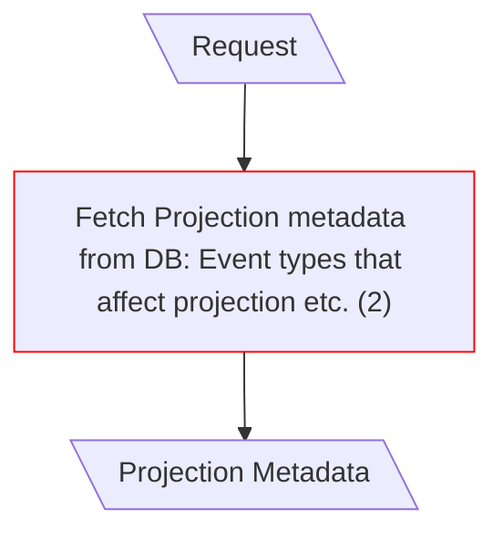
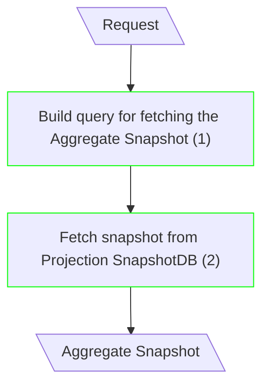
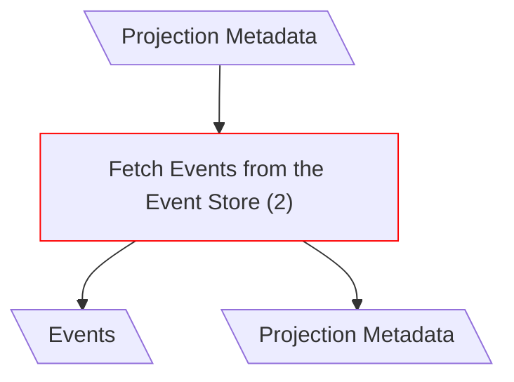
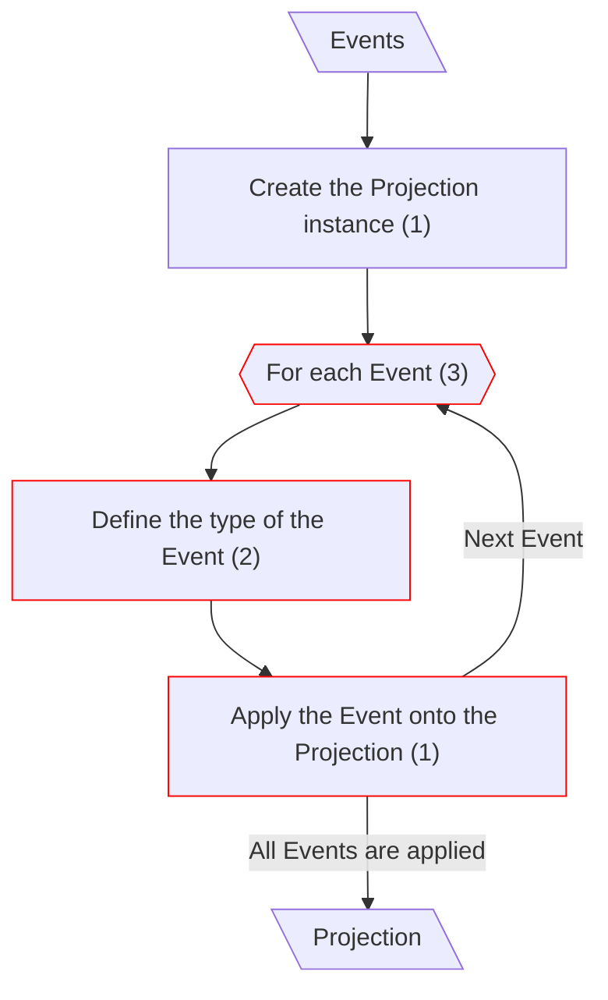
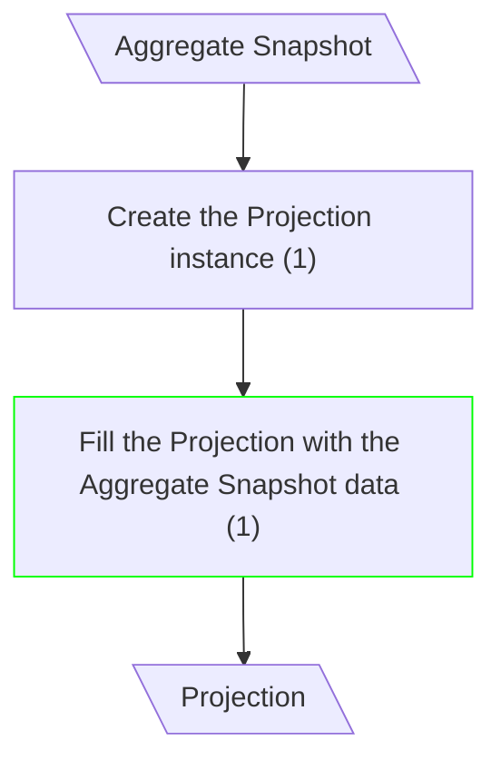
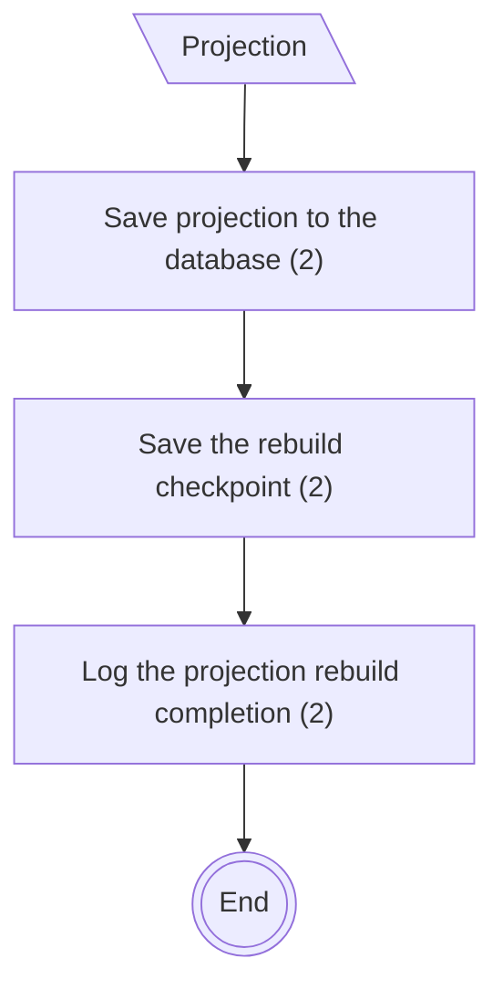
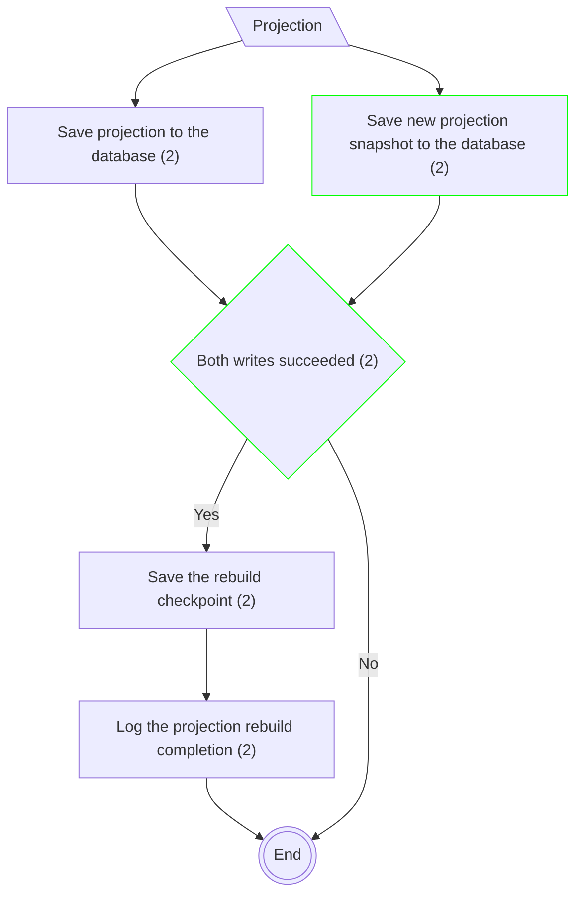

# Projection Rebuild

## Get Info About the Projection (Canonical CQRS)

**Input/Output Parameters:** Request, Projection Metadata (2)

| ID    | Name                                                                       | Type   | Weight |
|-------|----------------------------------------------------------------------------|--------|--------|
| BCS1  | Fetch Projection metadata from DB: Event types that affect projection etc. | remove | 1      |
| Total |                                                                            |        | 1      |

**Migration Complexity:** 2 × 1 = **2**  

---

## Fetch Snapshot (mCQRS)

**Input/Output Parameters:** Request, Aggregate Snapshot (2)

| ID    | Name                                            | Type          | Weight |
|-------|-------------------------------------------------|---------------|--------|
| BCS1  | Build query for fetching the Aggregate Snapshot | sequence      | 1      |
| BCS2  | Fetch snapshot from Projection SnapshotDB       | function call | 2      |
| Total |                                                 |               | 3      |

**Migration Complexity:** 2 × 3 = **6**  

---

## Fetch Events (Canonical CQRS)

**Input/Output Parameters:** Projection Metadata, Events (2)

| ID    | Name                              | Type   | Weight |
|-------|-----------------------------------|--------|--------|
| BCS1  | Fetch Events from the Event Store | remove | 1      |
| Total |                                   |        | 1      |

**Migration Complexity:** 2 × 1 = **2**  

---

## Build New Projection (Canonical CQRS)

**Input/Output Parameters:** Events, Projection (2)

## Build New Projection (mCQRS)

**Input/Output Parameters:** Aggregate Snapshot, Projection (2)

| ID    | Name                                                 | Type     | Weight |
|-------|------------------------------------------------------|----------|--------|
| BCS1  | For each Event                                       | remove   | 1      |
| BCS2  | Define the type of the Event                         | remove   | 1      |
| BCS3  | Apply the Event onto the Projection                  | remove   | 1      |
| BCS4  | Fill the Projection with the Aggregate Snapshot data | sequence | 1      |
| Total |                                                      |          | 4      |

**Migration Complexity:** 2 × 4 = **8**

---

## Save Projection (Canonical CQRS)

## Save Projection (mCQRS)

**Input/Output Parameters:** Projection (1)

| ID    | Name                                         | Type          | Weight |
|-------|----------------------------------------------|---------------|--------|
| BCS1  | Save new projection snapshot to the database | function call | 2      |
| BCS2  | Both writes succeeded                        | branch        | 2      |
| Total |                                              |               | 4      |

**Migration Complexity:** 1 × 4 = **4**  

---

## Total

2 + 6 + 2 + 8 + 4 = 22
