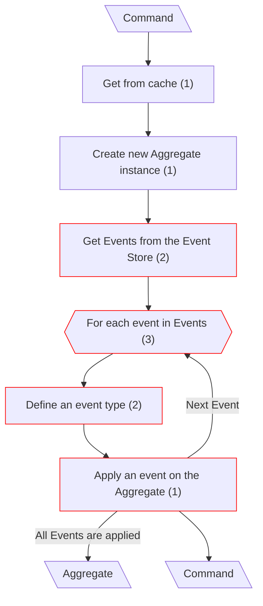
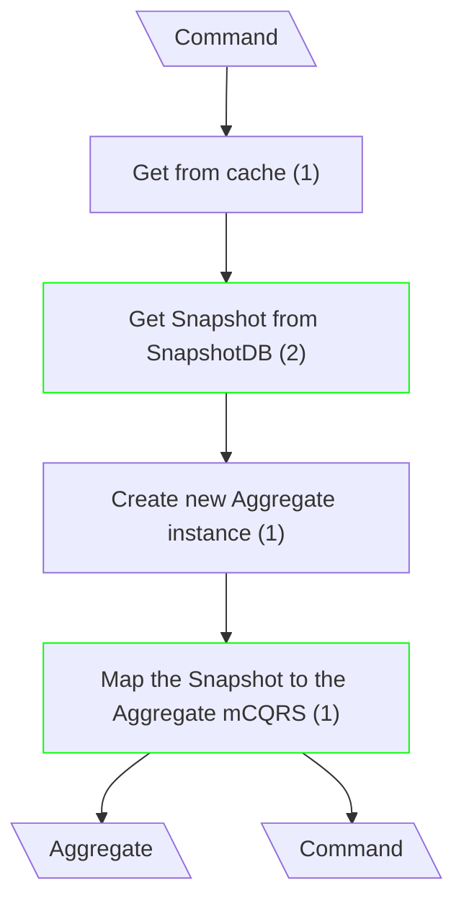
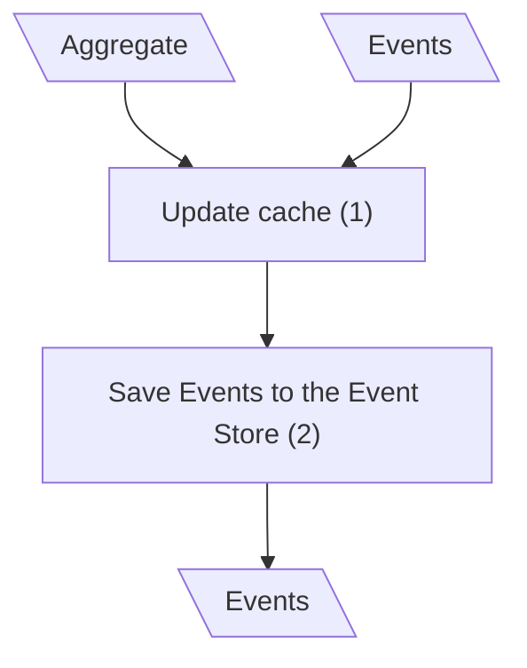
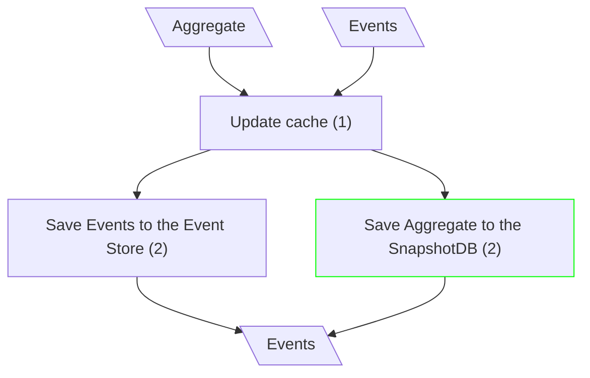

# Update Entity

## Fetch the Aggregate (Canonical CQRS)

## Fetch the Aggregate (mCQRS)

**Input/Output Parameters:** Command, Aggregate (2)

| ID    | Name                                    | Type          | Weight |
|-------|-----------------------------------------|---------------|--------|
| BCS1  | Get Events from the Event Store         | remove        | 1      |
| BCS2  | For each event in Events                | remove        | 1      |
| BCS3  | Define an event type                    | remove        | 1      |
| BCS4  | Apply an event on the Aggregate         | remove        | 1      |
| BCS5  | Get Snapshot from SnapshotDB            | function call | 2      |
| BCS6  | Map the Snapshot to the Aggregate mCQRS | sequence      | 1      |
| Total |                                         |               | 7      |

**Migration Complexity:** 2 × 7 = **14**  

---

## Save Aggregate (Canonical CQRS)

## Save Aggregate (mCQRS)

**Input/Output Parameters:** Aggregate, Events (2)

| ID    | Name                             | Type          | Weight |
|-------|----------------------------------|---------------|--------|
| BCS1  | Save Aggregate to the SnapshotDB | function call | 2      |
| Total |                                  |               | 2      |

**Migration Complexity:** 2 × 2 = **4**  

---

## Total

14 + 4 = 18
