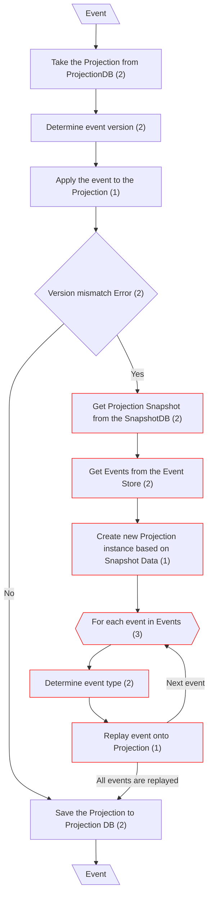
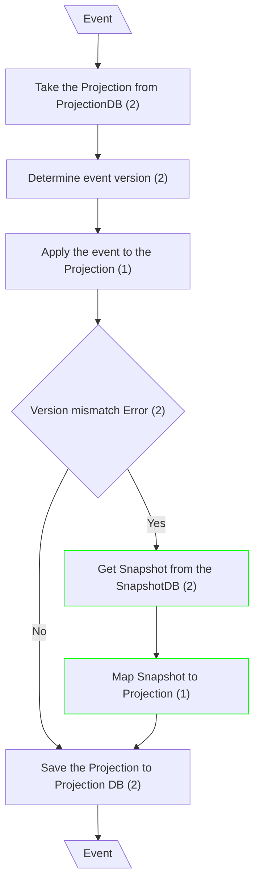

# Eventual Consistency

## Handle Event - Update Projection (Classical CQRS)

## Handle Event - Update Projection (mCQRS)

**Input/Output Parameters:** Event (1)

| ID    | Name                                                  | Type          | Weight |
|-------|-------------------------------------------------------|---------------|--------|
| BCS1  | Get Projection Snapshot from the SnapshotDB           | remove        | 1      |
| BCS2  | Get Events from the Event Store                       | remove        | 1      |
| BCS3  | Create new Projection instance based on Snapshot Data | remove        | 1      |
| BCS4  | For each event in Events                              | remove        | 1      |
| BCS5  | Determine event type                                  | remove        | 1      |
| BCS6  | Replay event onto Projection                          | remove        | 1      |
| BCS7  | Get Snapshot from the SnapshotDB                      | function call | 2      |
| BCS8  | Map Snapshot to Projection                            | sequence      | 1      |
| Total |                                                       |               | 9      |

**Migration Complexity:** 1 × 9 = **9**  

---

## Total

9
