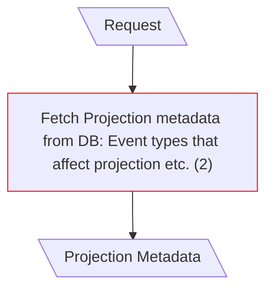
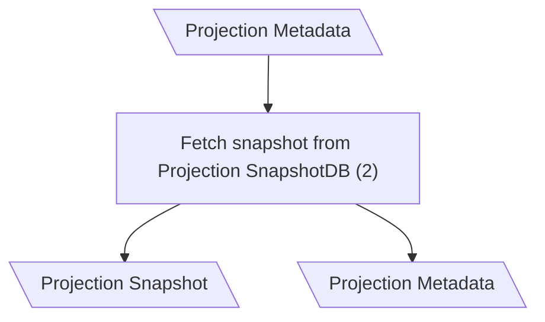
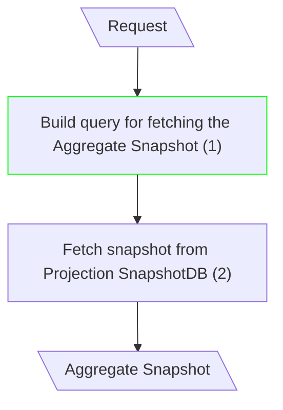
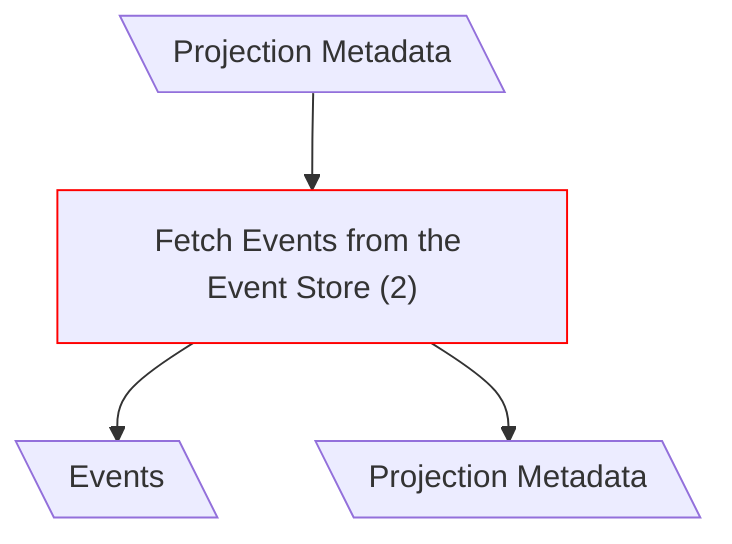
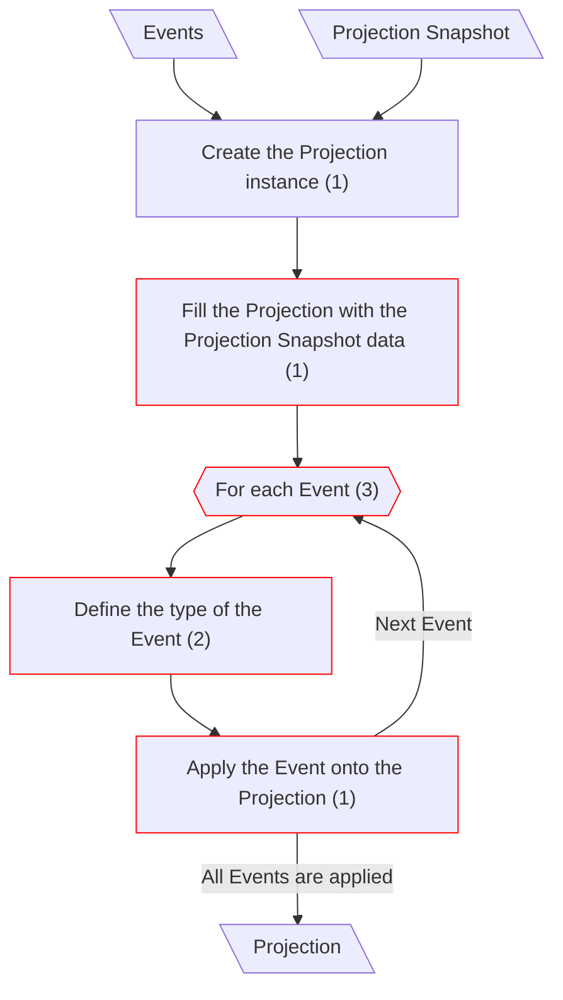
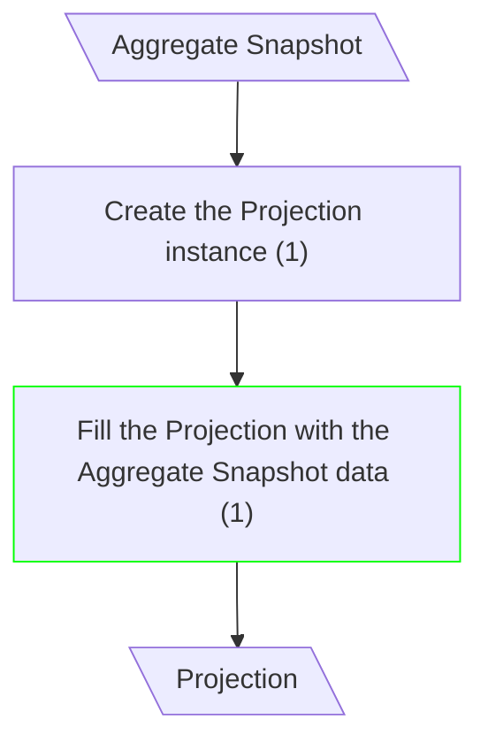

# Projection Rebuild

## Get Info About the Projection (Classical CQRS)

**Input/Output Parameters:** Request, Projection Metadata (2)

| ID    | Name                                                                       | Type          | Weight |
|-------|----------------------------------------------------------------------------|---------------|--------|
| BCS1  | Fetch Projection metadata from DB: Event types that affect projection etc. | remove        | 1      |
| Total |                                                                            |               | 1      |

**Migration Complexity:** 1 × 2 = **2**  

---

## Fetch Snapshot (Classical CQRS)

## Fetch Snapshot (mCQRS)

**Input/Output Parameters:** Request, Aggregate Snapshot (2)

| ID    | Name                                            | Type          | Weight |
|-------|-------------------------------------------------|---------------|--------|
| BCS1  | Build query for fetching the Aggregate Snapshot | sequence      | 1      |
| Total |                                                 |               | 1      |

**Migration Complexity:** 2 × 1 = **2**  

---

## Fetch Events (Classical CQRS)

**Input/Output Parameters:** Projection Metadata, Events (2)

| ID    | Name                                | Type          | Weight |
|-------|-------------------------------------|---------------|--------|
| BCS1  | Fetch Events from the Event Store   | remove        | 1      |
| Total |                                     |               | 1      |

**Migration Complexity:** 2 × 1 = **2**  

---

## Build New Projection (Classical CQRS)

**Input/Output Parameters:** Events, Projection Snapshot, Projection (3)

| ID    | Name                                                  | Type     | Weight |
|-------|-------------------------------------------------------|----------|--------|
| BCS1  | Fill the Projection with the Projection Snapshot data | remove   | 1      |
| BCS2  | For each Event                                        | remove   | 1      |
| BCS3  | Define the type of the Event                          | remove   | 1      |
| BCS4  | Apply the Event onto the Projection                   | remove   | 1      |
| Total |                                                       |          | 4      |

## Build New Projection (mCQRS)

**Input/Output Parameters:** Aggregate Snapshot, Projection (2)

| ID    | Name                                                  | Type     | Weight |
|-------|-------------------------------------------------------|----------|--------|
| BCS5  | Fill the Projection with the Aggregate Snapshot data  | sequence | 1      |
| Total |                                                       |          | 1      |

**Migration Complexity:** 2 × 1 + 3 × 4 = **14**

---

## Total

2 + 2 + 2 + 14 = 20
