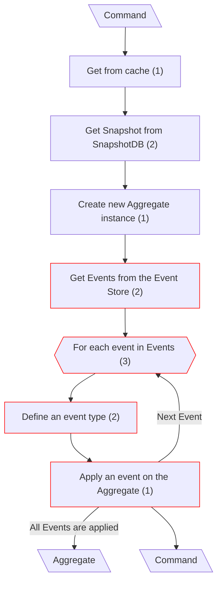
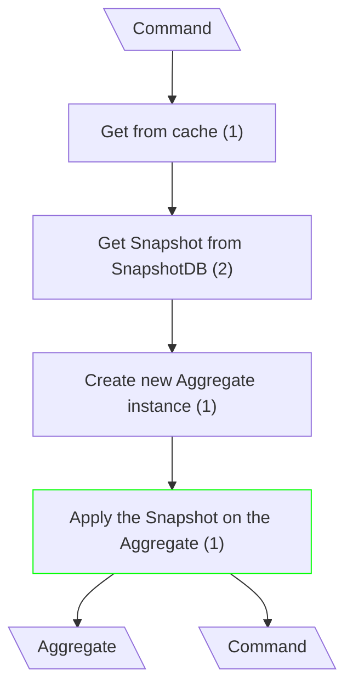
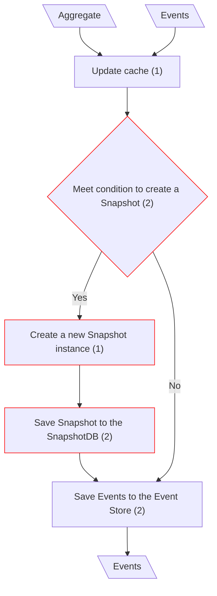
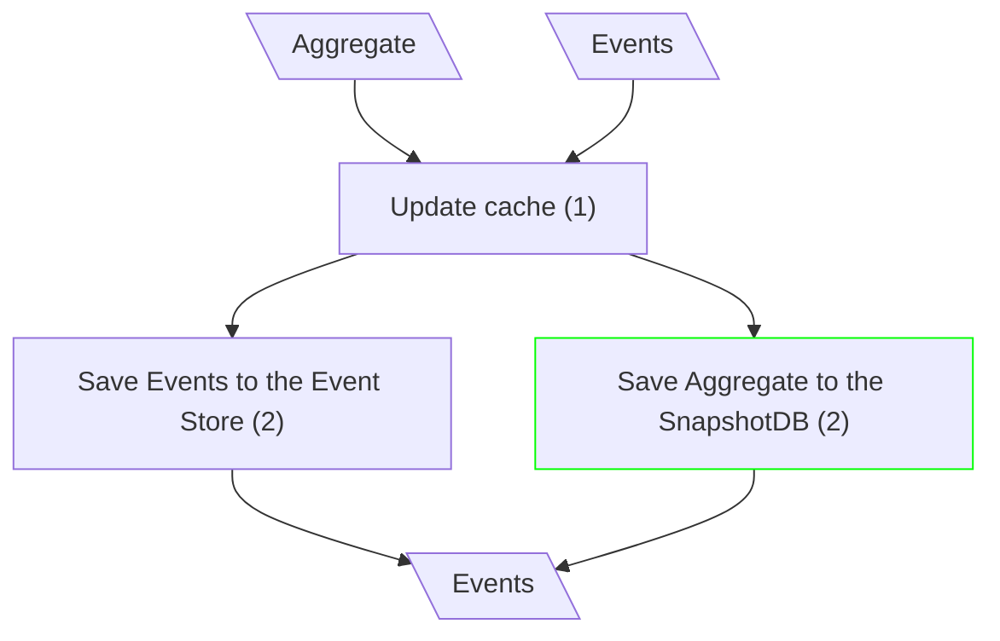

# Update Entity

## Fetch the Aggregate (Classical CQRS)

## Fetch the Aggregate (mCQRS)

**Input/Output Parameters:** Command, Aggregate (2)

| ID    | Name                                  | Type          | Weight |
|-------|---------------------------------------|---------------|--------|
| BCS1  | Get Events from the Event Store.      | remove        | 1      |
| BCS2  | For each event in Events.             | remove        | 1      |
| BCS3  | Define an event type                  | remove        | 1      |
| BCS4  | Apply an event on the Aggregate       | remove        | 1      |
| BCS5  | Apply the Snapshot on the Aggregate   | sequence      | 1      |
| Total |                                       |               | 5      |

**Migration Complexity:** 2 × 5 = **10**  

---

## Save Aggregate (Classical CQRS)

## Save Aggregate (mCQRS)

**Input/Output Parameters:** Aggregate, Events (2)

| ID    | Name                                | Type          | Weight |
|-------|-------------------------------------|---------------|--------|
| BCS1  | Meet condition to create a Snapshot | remove        | 1      |
| BCS2  | Create a new Snapshot instance      | remove        | 1      |
| BCS3  | Save Snapshot to the SnapshotDB     | remove        | 1      |
| BCS4  | Save Aggregate to the SnapshotDB    | function call | 2      |
| Total |                                     |               | 5      |

**Migration Complexity:** 2 × 5 = **10**  

---

## Total

10 + 10 = 20
