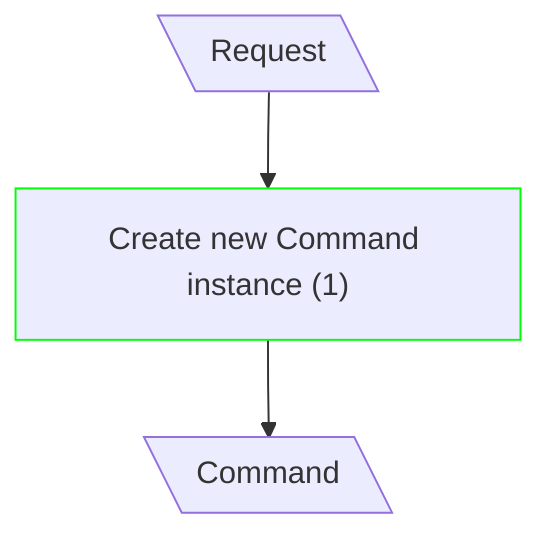
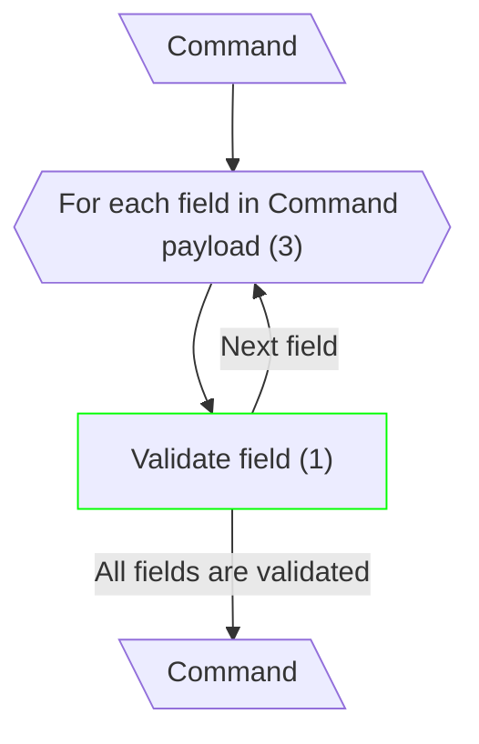
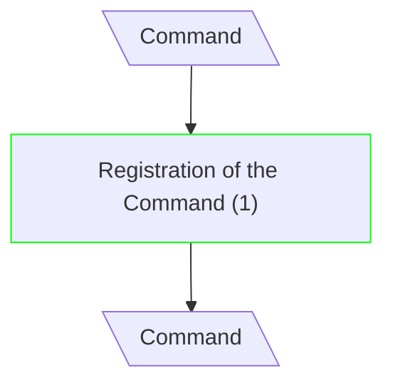
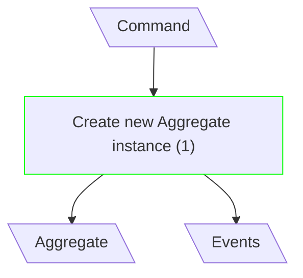
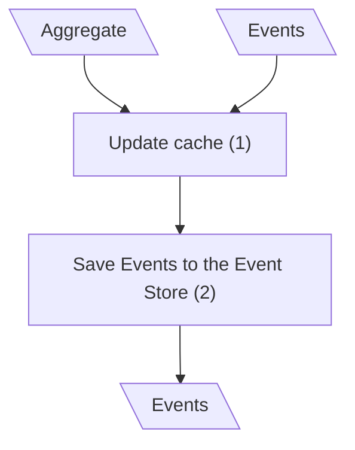
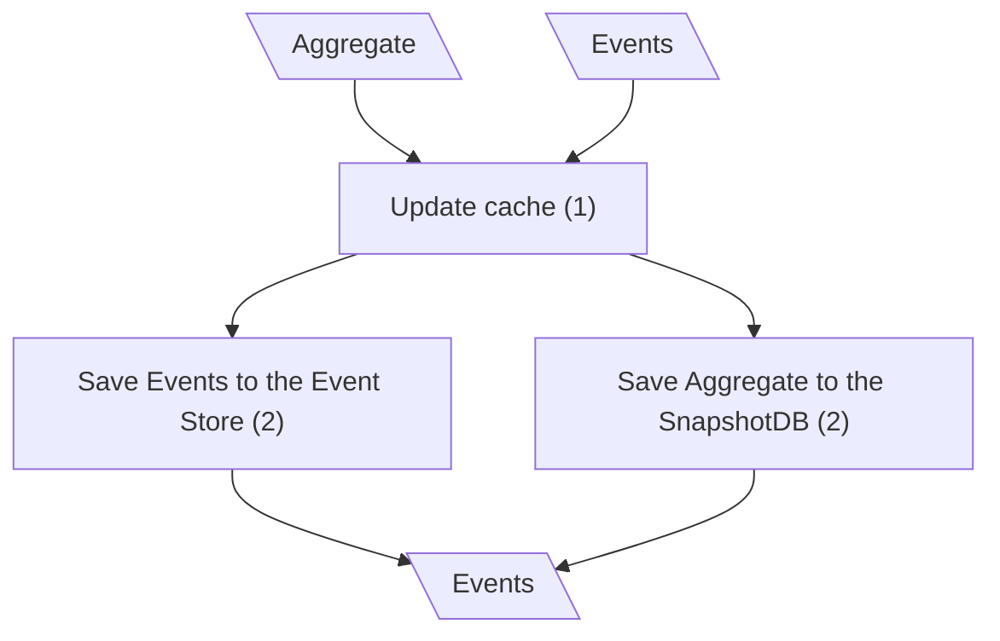
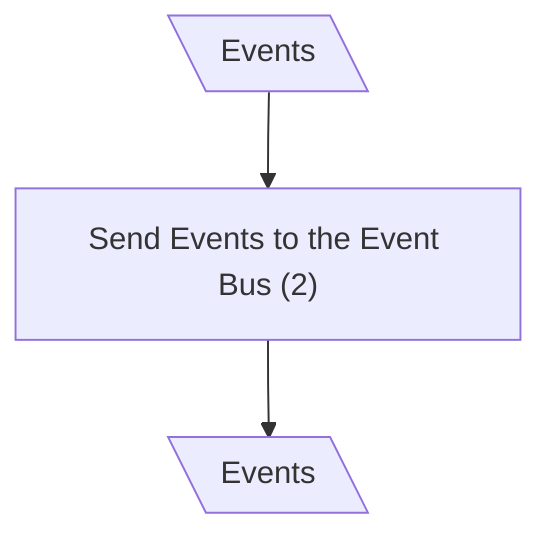

# Create Entity

## Create Command

**Input/Output Parameters:** Request, Command (2)

| ID    | Name                        | Type     | Weight |
|-------|-----------------------------|----------|--------|
| BCS1  | Create new Command instance | sequence | 1      |
| Total |                             |          | 1      |

**Implementation Complexity:** 2 × 1 = **2**  
**Modification Complexity:** 2 × 1 = **2**

---

## Validate Command

**Input/Output Parameters:** Command (1)

| ID    | Name                              | Type      | Weight |
|-------|-----------------------------------|-----------|--------|
| BCS1  | For each field in Command payload | iteration | 3      |
| BCS2  | Validate field                    | sequence  | 1      |
| Total |                                   |           | 4      |

**Implementation Complexity:** 1 × 4 = **4**  
**Modification Complexity:** 1 × 1 = **1**

---

## Route Command

**Input/Output Parameters:** Command (1)

| ID    | Name                        | Type     | Weight |
|-------|-----------------------------|----------|--------|
| BCS1  | Registration of the Command | sequence | 1      |
| Total |                             |          | 1      |

**Implementation Complexity:** 1 × 1 = **1**  
**Modification Complexity:** 1 × 1 = **1**

---

## Create the Aggregate

**Input/Output Parameters:** Command, Aggregate, Events (3)

| ID    | Name                          | Type     | Weight |
|-------|-------------------------------|----------|--------|
| BCS1  | Create new Aggregate instance | sequence | 1      |
| Total |                               |          | 1      |

**Implementation Complexity:** 3 × 1 = **3**  
**Modification Complexity:** 3 × 1 = **3**

---

## Save Aggregate (Classical CQRS)

**Input/Output Parameters:** Aggregate, Events (2)

| ID    | Name                           | Type          | Weight |
|-------|--------------------------------|---------------|--------|
| BCS1  | Update cache                   | sequence      | 1      |
| BCS2  | Save Events to the Event Store | function call | 2      |
| Total |                                |               | 3      |

**Implementation Complexity:** 2 × 3 = **6**  
**Modification Complexity:** 2 × 0 = **0**

---

## Save Aggregate (mCQRS)

**Input/Output Parameters:** Aggregate, Events (2)

| ID    | Name                             | Type          | Weight |
|-------|----------------------------------|---------------|--------|
| BCS1  | Update cache                     | sequence      | 1      |
| BCS2  | Save Events to the Event Store   | function call | 2      |
| BCS3  | Save Aggregate to the SnapshotDB | function call | 2      |
| Total |                                  |               | 5      |

**Implementation Complexity:** 2 × 5 = **10**  
**Modification Complexity:** 2 × 0 = **0**

---

## Dispatch Events

**Input/Output Parameters:** Events (1)

| ID    | Name                         | Type          | Weight |
|-------|------------------------------|---------------|--------|
| BCS1  | Send Events to the Event Bus | function call | 2      |
| Total |                              |               | 2      |

**Implementation Complexity:** 1 × 2 = **2**  
**Modification Complexity:** 1 × 0 = **0**
