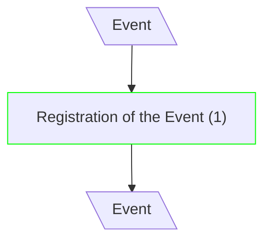
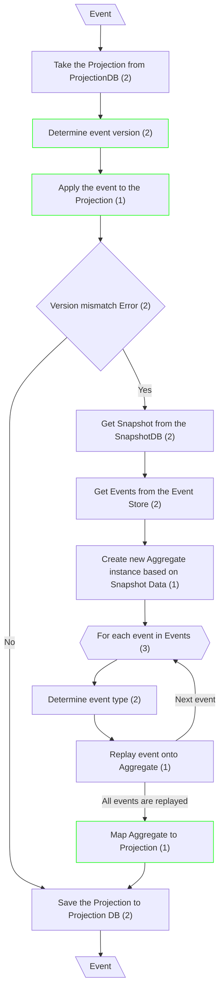
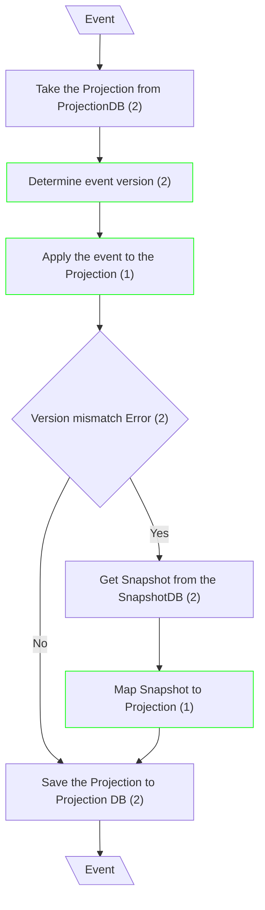
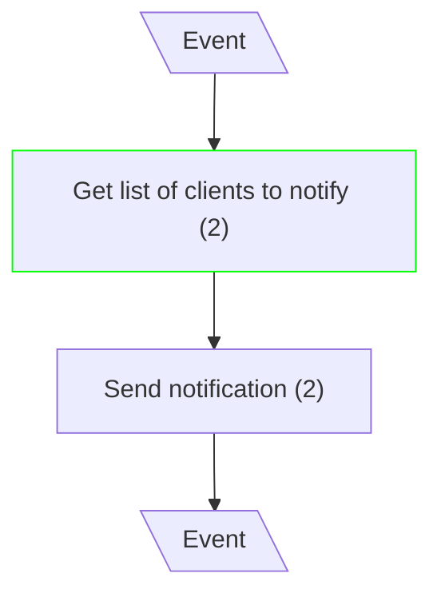

# Eventual Consistency

## Route Event

**Input/Output Parameters:** Event (1)

| ID    | Name                      | Type     | Weight |
|-------|---------------------------|----------|--------|
| BCS1  | Registration of the Event | sequence | 1      |
| Total |                           |          | 1      |

**Implementation Complexity:** 1 × 1 = **1**  
**Modification Complexity:** 1 × 1 = **1**

---

## Handle Event - Update Projection (Classical CQRS)

**Input/Output Parameters:** Event (1)

| ID    | Name                                                 | Type          | Weight |
|-------|------------------------------------------------------|---------------|--------|
| BCS1  | Take the Projection from ProjectionDB                | function call | 2      |
| BCS2  | Determine event version                              | branch        | 2      |
| BCS3  | Apply the event to the Projection                    | sequence      | 1      |
| BCS4  | Version mismatch Error                               | branch        | 2      |
| BCS5  | Save the Projection to Projection DB                 | function call | 2      |
| BCS6  | Get Snapshot from the SnapshotDB                     | function call | 2      |
| BCS7  | Get Events from the Event Store                      | function call | 2      |
| BCS8  | Create new Aggregate instance based on Snapshot Data | sequence      | 1      |
| BCS9  | For each event in Events                             | iteration     | 3      |
| BCS10 | Determine event type                                 | branch        | 2      |
| BCS11 | Replay event onto Aggregate                          | sequence      | 1      |
| BCS12 | Map Aggregate to Projection                          | sequence      | 1      |
| Total |                                                      |               | 21     |

**Implementation Complexity:** 1 × 21 = **21**  
**Modification Complexity:** 1 × 4 = **4**

---

## Handle Event - Update Projection (mCQRS)

**Input/Output Parameters:** Event (1)

| ID    | Name                                  | Type          | Weight |
|-------|---------------------------------------|---------------|--------|
| BCS1  | Take the Projection from ProjectionDB | function call | 2      |
| BCS2  | Determine event version               | branch        | 2      |
| BCS3  | Apply the event to the Projection    | sequence      | 1      |
| BCS4  | Version mismatch Error                | branch        | 2      |
| BCS5  | Save the Projection to Projection DB | function call | 2      |
| BCS6  | Get Snapshot from the SnapshotDB     | function call | 2      |
| BCS7  | Map Snapshot to Projection           | sequence      | 1      |
| Total |                                       |               | 12     |

**Implementation Complexity:** 1 × 12 = **12**  
**Modification Complexity:** 1 × 4 = **4**

---

## Notify Client

**Input/Output Parameters:** Event (1)

| ID    | Name                           | Type          | Weight |
|-------|--------------------------------|---------------|--------|
| BCS1  | Get list of clients to notify  | function call | 2      |
| BCS2  | Send notification              | function call | 2      |
| Total |                                |               | 4      |

**Implementation Complexity:** 1 × 4 = **4**  
**Modification Complexity:** 1 × 2 = **2**
