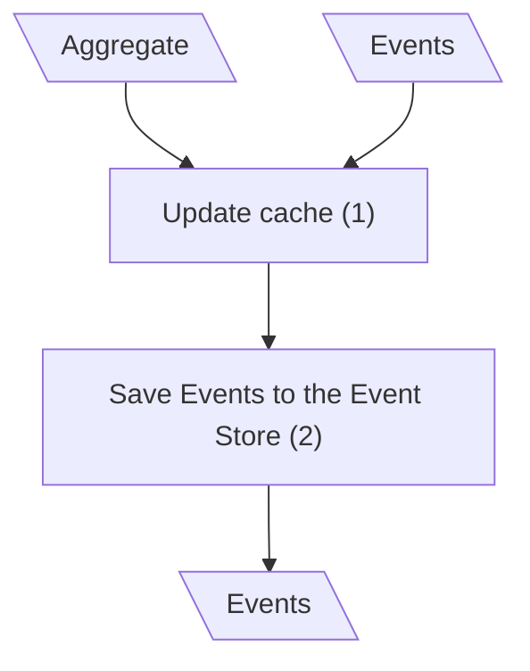
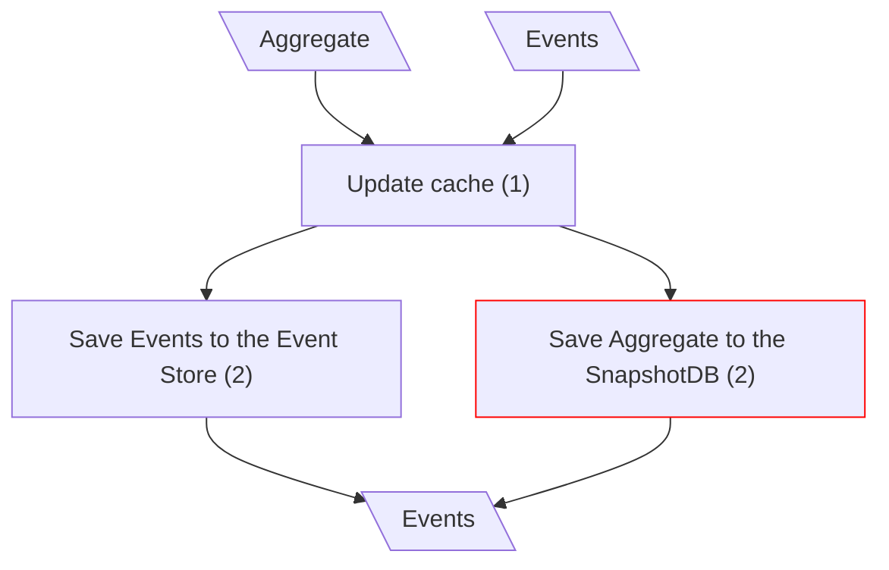

# Create Entity

## Save Aggregate (Classical CQRS)

## Save Aggregate (mCQRS)

**Input/Output Parameters:** Aggregate, Events (2)

| ID    | Name                             | Type   | Weight |
|-------|----------------------------------|--------|--------|
| BCS1  | Save Aggregate to the SnapshotDB | remove | 1      |
| Total |                                  |        | 1      |

**Migration Complexity:** 2 × 1 = **2**  

---

## Total

2
