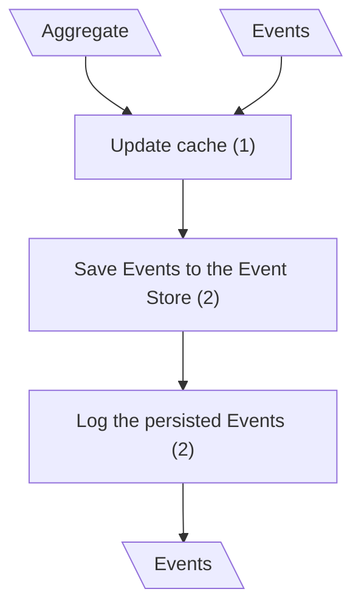
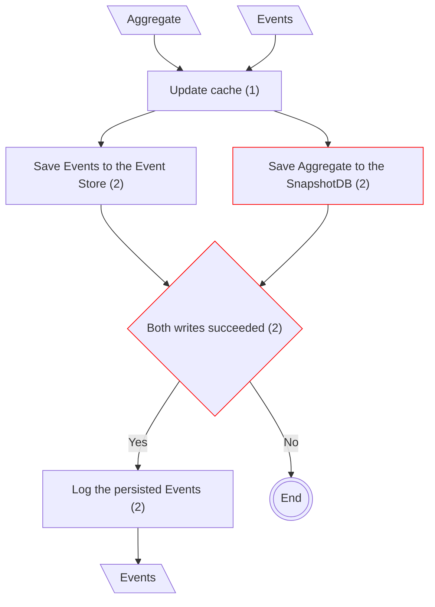

# Create Entity

## Save Aggregate (Classical CQRS)

## Save Aggregate (mCQRS)

**Input/Output Parameters:** Aggregate, Events (2)

| ID    | Name                             | Type   | Weight |
|-------|----------------------------------|--------|--------|
| BCS1  | Save Aggregate to the SnapshotDB | remove | 1      |
| BCS2  | Both writes succeeded            | remove | 1      |
| Total |                                  |        | 2      |

**Migration Complexity:** 2 × 2 = **4**  

---

## Total

4
