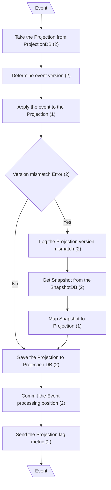
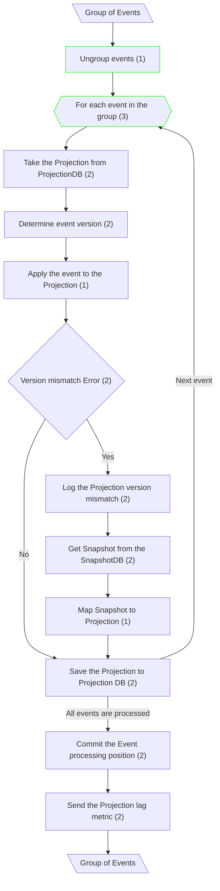
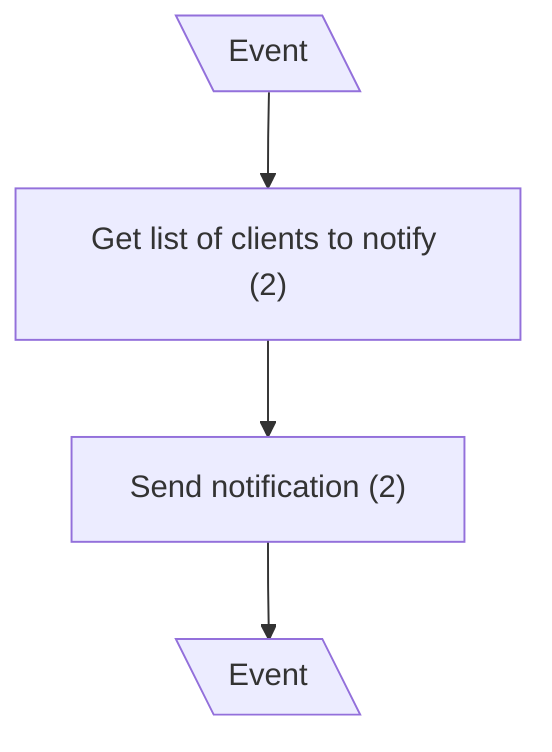
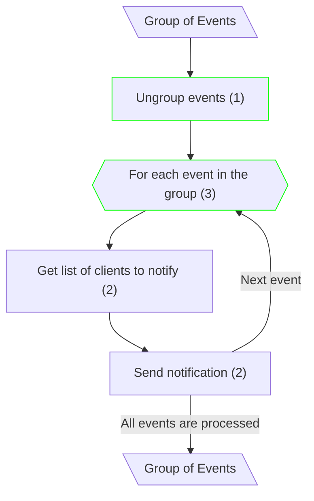

# Eventual Consistency

## Handle Event - Update Projection (mCQRS)

**Input/Output Parameters:** Event (1)

## Handle Event - Update Projection (mCQRS+CoE)

**Input/Output Parameters:** Group of Events (1)

| ID    | Name                        | Type      | Weight |
|-------|-----------------------------|-----------|--------|
| BCS1  | Ungroup events              | sequence  | 1      |
| BCS2  | For each event in the group | iteration | 3      |
| Total |                             |           | 4      |

**Migration Complexity:** 1 × 4 = **4**  

---

## Notify Client (mCQRS)

**Input/Output Parameters:** Event (1)

## Notify Client (mCQRS+CoE)

**Input/Output Parameters:** Group of Events (1)

| ID    | Name                        | Type      | Weight |
|-------|-----------------------------|-----------|--------|
| BCS1  | Ungroup events              | sequence  | 1      |
| BCS2  | For each event in the group | iteration | 3      |
| Total |                             |           | 4      |

**Migration Complexity:** 1 × 4 = **4**  

---

## Total

4 + 4 = 8
