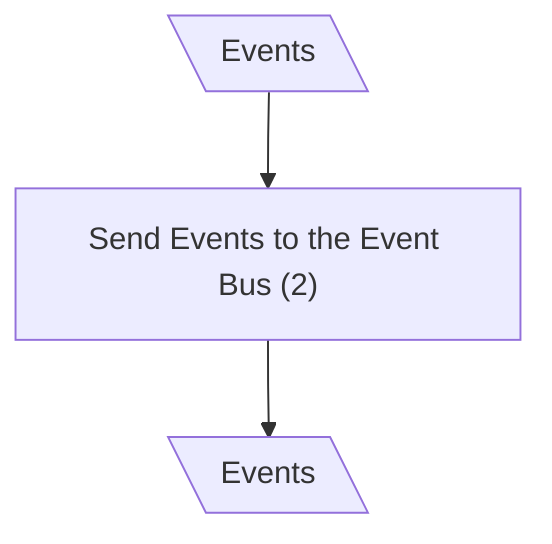
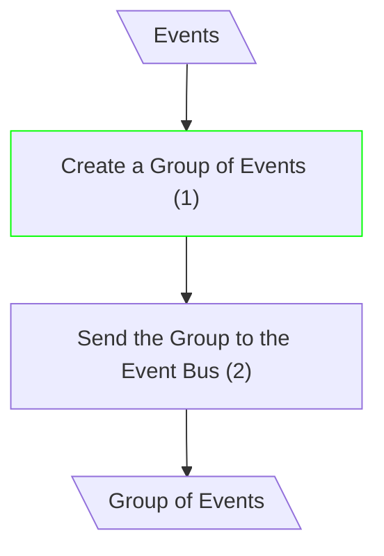

# Update Entity

## Dispatch Events (mCQRS)

**Input/Output Parameters:** Events (1)

## Dispatch Events (mCQRS+CoE)

**Input/Output Parameters:** Events, Group of Events (2)

| ID    | Name                         | Type          | Weight |
|-------|------------------------------|---------------|--------|
| BCS1  | Create a Group of Events     | sequence      | 1      |
| Total |                              |               | 1      |

**Migration Complexity:** 2 × 1 = **2**

---

## Total

2
