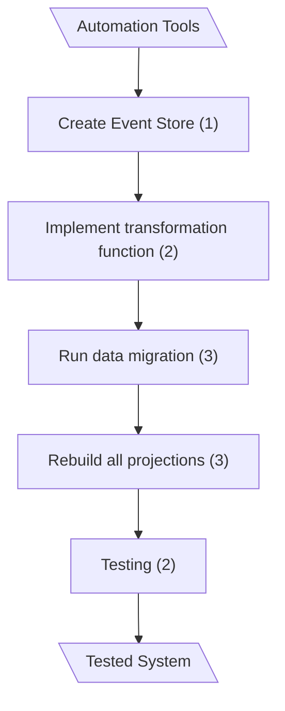
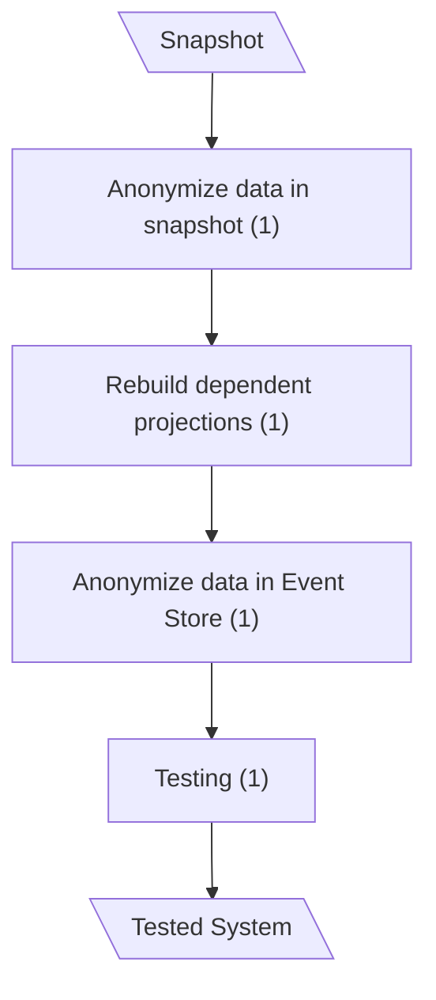
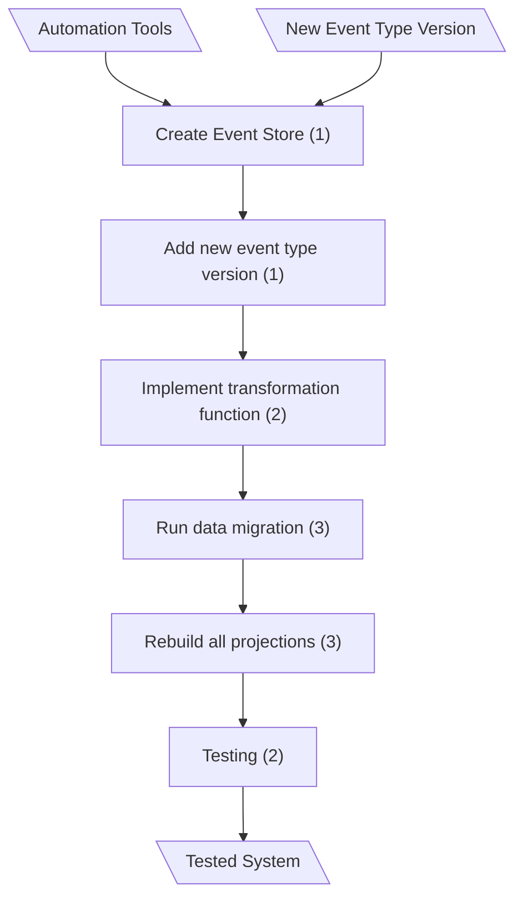
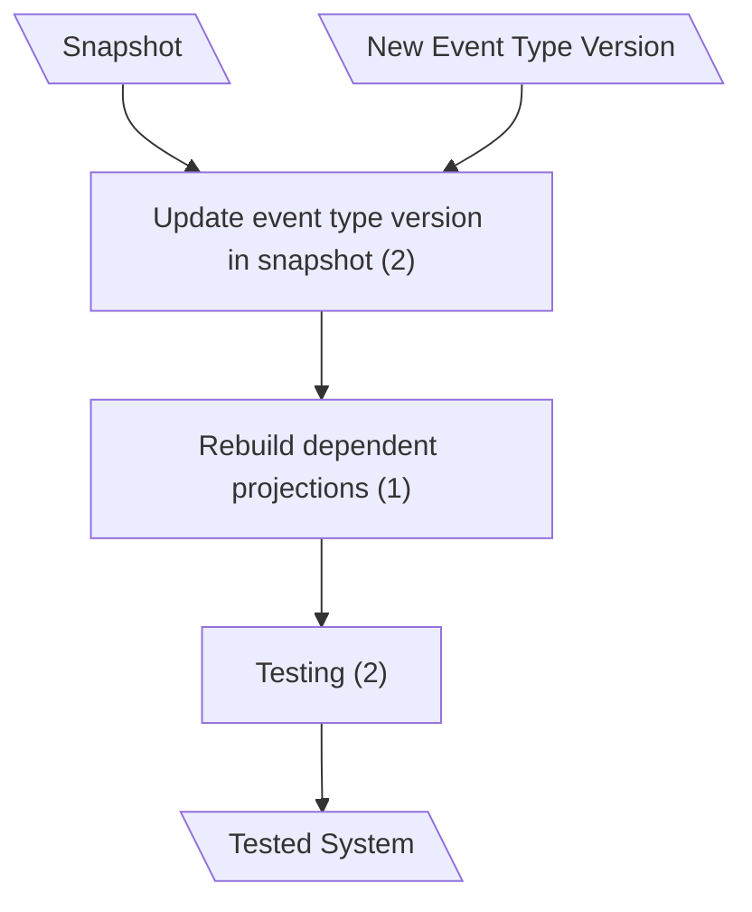

# Problem Space

Since these calculations are made not over processes within the system, but over the process that developers perform to complete a typical task, there is no calculation of the modification metric. Also, the calculation is performed as the sum of all activities (without multiplying by the sum of parameters).

## User Data Deletion According to GDPR Requirements (Classical CQRS)

**Implementation Complexity:** **11**

---

## User Data Deletion According to GDPR Requirements (mCQRS)

**Implementation Complexity:** **4**  

---

## Event Type Version Update Operation Activities (Classical CQRS)

**Implementation Complexity:** **12**  

---

## Event Type Version Update Operation Activities (mCQRS)

**Implementation Complexity:** **5**
