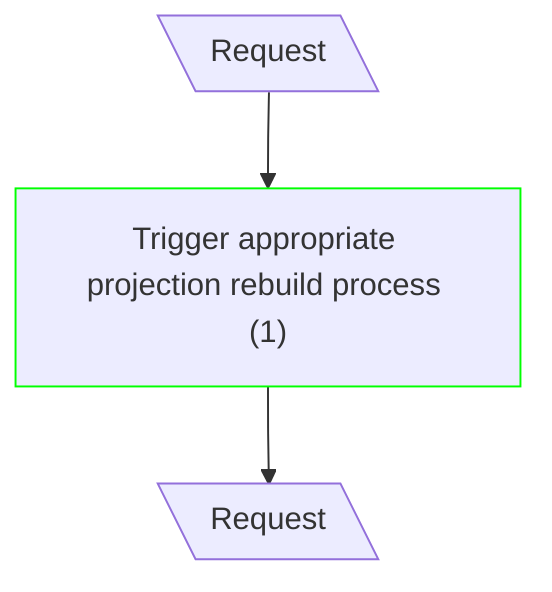
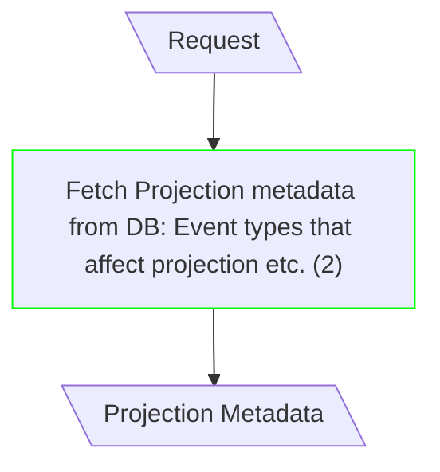
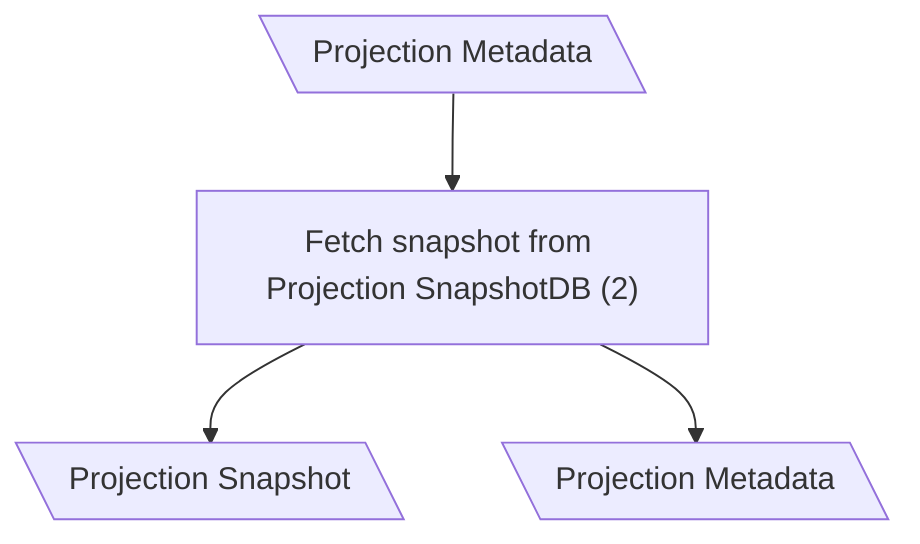
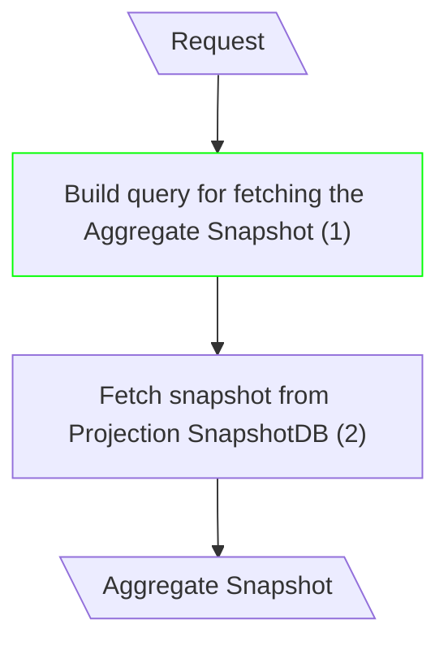
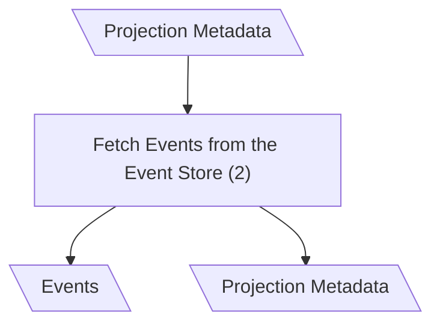
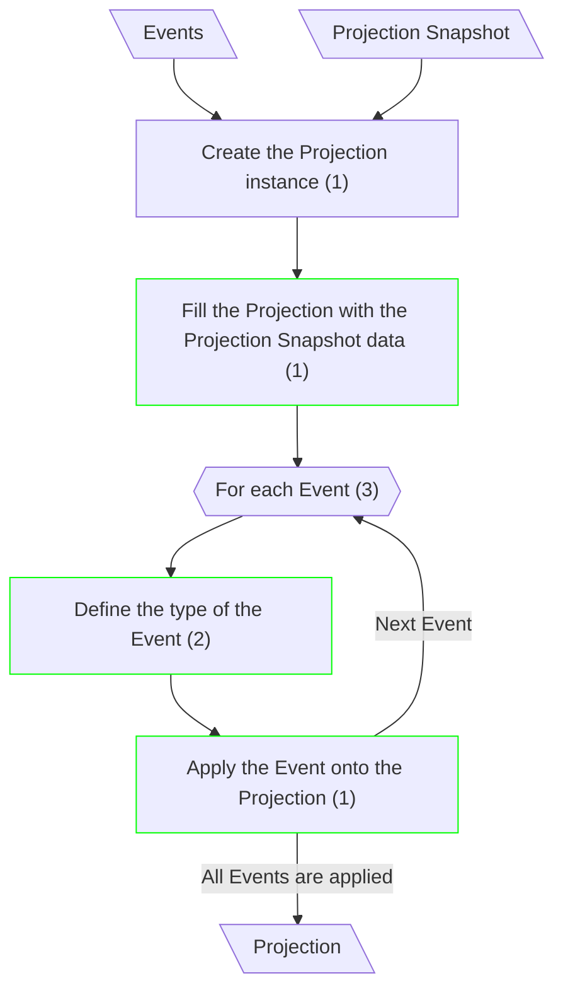
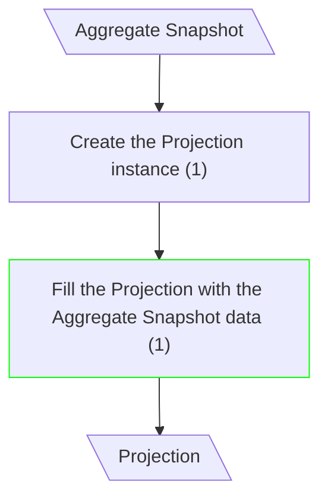
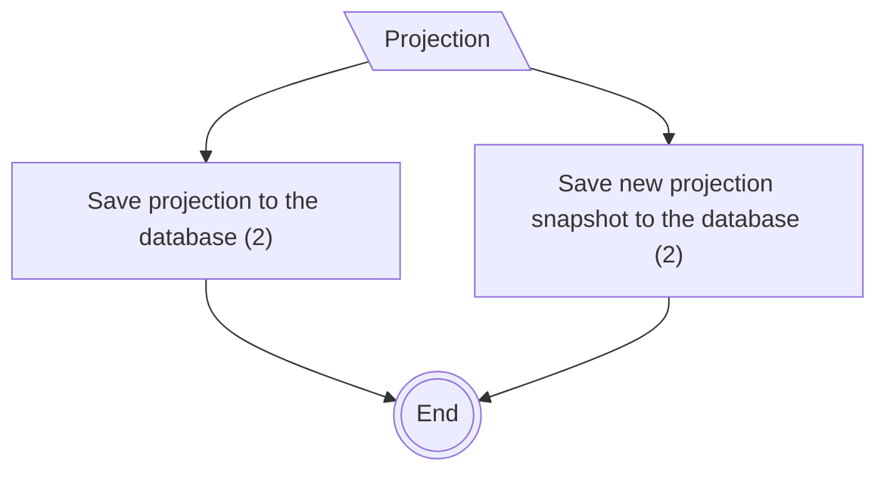

# Projection Rebuild

## Process Rebuild Request

**Input/Output Parameters:** Request (1)

| ID    | Name                                           | Type     | Weight |
|-------|------------------------------------------------|----------|--------|
| BCS1  | Trigger appropriate projection rebuild process | sequence | 1      |
| Total |                                                |          | 1      |

**Implementation Complexity:** 1 × 1 = **1**  
**Modification Complexity:** 1 × 1 = **1**

---

## Get Info About the Projection (Classical CQRS)

**Input/Output Parameters:** Request, Projection Metadata (2)

| ID    | Name                                                                       | Type          | Weight |
|-------|----------------------------------------------------------------------------|---------------|--------|
| BCS1  | Fetch Projection metadata from DB: Event types that affect projection etc. | function call | 2      |
| Total |                                                                            |               | 2      |

**Implementation Complexity:** 2 × 2 = **4**  
**Modification Complexity:** 2 × 2 = **4**

---

## Fetch Snapshot (Classical CQRS)

**Input/Output Parameters:** Projection Metadata, Projection Snapshot (2)

| ID    | Name                                      | Type          | Weight |
|-------|-------------------------------------------|---------------|--------|
| BCS1  | Fetch snapshot from Projection SnapshotDB | function call | 2      |
| Total |                                           |               | 2      |

**Implementation Complexity:** 2 × 2 = **4**  
**Modification Complexity:** 2 × 0 = **0**

---

## Fetch Snapshot (mCQRS)

**Input/Output Parameters:** Request, Aggregate Snapshot (2)

| ID    | Name                                            | Type          | Weight |
|-------|-------------------------------------------------|---------------|--------|
| BCS1  | Build query for fetching the Aggregate Snapshot | sequence      | 1      |
| BCS2  | Fetch snapshot from Projection SnapshotDB       | function call | 2      |
| Total |                                                 |               | 3      |

**Implementation Complexity:** 2 × 3 = **6**  
**Modification Complexity:** 2 × 1 = **2**

---

## Fetch Events (Classical CQRS)

**Input/Output Parameters:** Projection Metadata, Events (2)

| ID    | Name                                | Type          | Weight |
|-------|-------------------------------------|---------------|--------|
| BCS1  | Fetch Events from the Event Store   | function call | 2      |
| Total |                                     |               | 2      |

**Implementation Complexity:** 2 × 2 = **4**  
**Modification Complexity:** 2 × 0 = **0**

---

## Build New Projection (Classical CQRS)

**Input/Output Parameters:** Events, Projection Snapshot, Projection (3)

| ID    | Name                                                  | Type      | Weight |
|-------|-------------------------------------------------------|-----------|--------|
| BCS1  | Create the Projection instance                        | sequence  | 1      |
| BCS2  | Fill the Projection with the Projection Snapshot data | sequence  | 1      |
| BCS3  | For each Event                                        | iteration | 3      |
| BCS4  | Define the type of the Event                          | branch    | 2      |
| BCS5  | Apply the Event onto the Projection                   | sequence  | 1      |
| Total |                                                       |           | 8      |

**Implementation Complexity:** 3 × 8 = **24**  
**Modification Complexity:** 3 × 4 = **12**

---

## Build New Projection (mCQRS)

**Input/Output Parameters:** Aggregate Snapshot, Projection (2)

| ID    | Name                                                 | Type     | Weight |
|-------|------------------------------------------------------|----------|--------|
| BCS1  | Create the Projection instance                       | sequence | 1      |
| BCS2  | Fill the Projection with the Aggregate Snapshot data | sequence | 1      |
| Total |                                                      |          | 2      |

**Implementation Complexity:** 2 × 2 = **4**  
**Modification Complexity:** 2 × 1 = **2**

---

## Save Projection

**Input/Output Parameters:** Projection (1)

| ID    | Name                                         | Type          | Weight |
|-------|----------------------------------------------|---------------|--------|
| BCS1  | Save projection to the database              | function call | 2      |
| BCS2  | Save new projection snapshot to the database | function call | 2      |
| Total |                                              |               | 4      |

**Implementation Complexity:** 1 × 4 = **4**  
**Modification Complexity:** 1 × 0 = **0**
