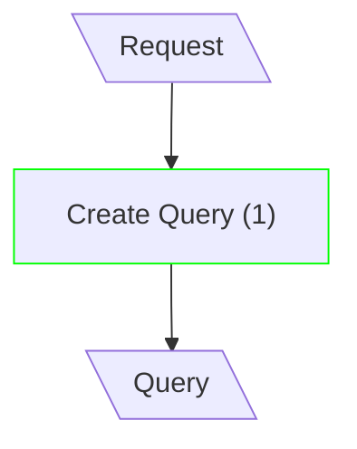
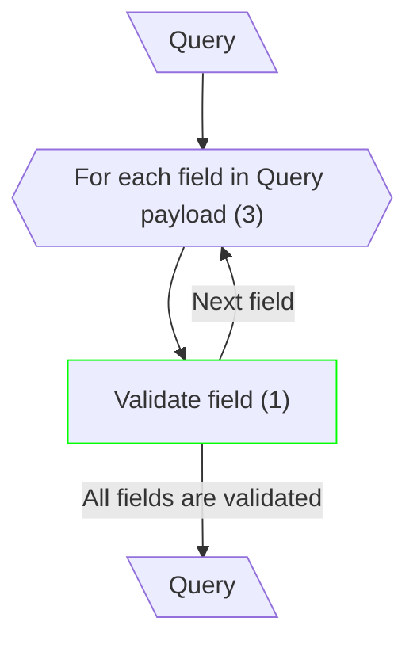
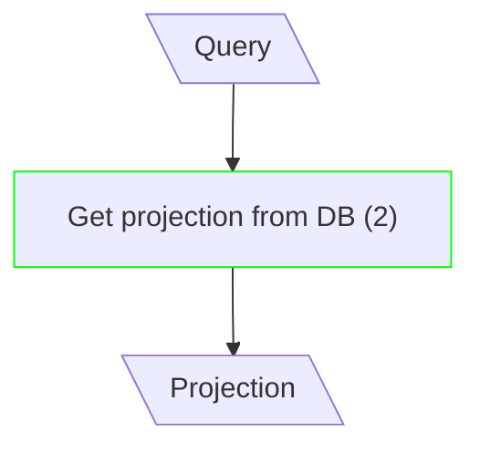
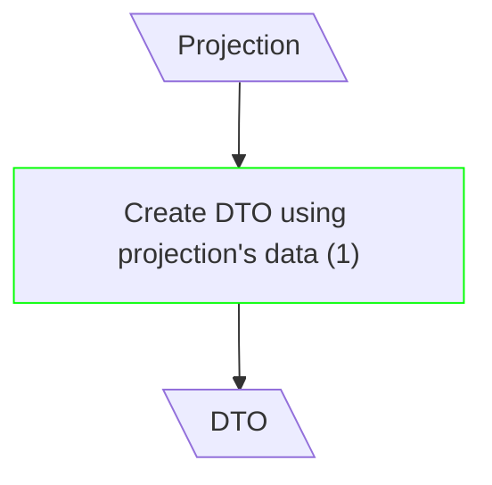

# Read Entity

## Create Query

**Input/Output Parameters:** Request, Query (2)

| ID    | Name         | Type     | Weight |
|-------|--------------|----------|--------|
| BCS1  | Create Query | sequence | 1      |
| Total |              |          | 1      |

**Implementation Complexity:** 2 × 1 = **2**  
**Modification Complexity:** 2 × 1 = **2**

---

## Validate Query

**Input/Output Parameters:** Query (1)

| ID    | Name                            | Type      | Weight |
|-------|---------------------------------|-----------|--------|
| BCS1  | For each field in Query payload | iteration | 3      |
| BCS2  | Validate field                  | sequence  | 1      |
| Total |                                 |           | 4      |

**Implementation Complexity:** 1 × 4 = **4**  
**Modification Complexity:** 1 × 1 = **1**

---

## Fetch Projection

**Input/Output Parameters:** Query, Projection (2)

| ID    | Name                    | Type          | Weight |
|-------|-------------------------|---------------|--------|
| BCS1  | Get projection from DB  | function call | 2      |
| Total |                         |               | 2      |

**Implementation Complexity:** 2 × 2 = **4**  
**Modification Complexity:** 2 × 2 = **4**

---

## Map Projection to DTO

**Input/Output Parameters:** Projection, DTO (2)

| ID    | Name                                | Type     | Weight |
|-------|-------------------------------------|----------|--------|
| BCS1  | Create DTO using projection's data  | sequence | 1      |
| Total |                                     |          | 1      |

**Implementation Complexity:** 2 × 1 = **2**  
**Modification Complexity:** 2 × 1 = **2**
