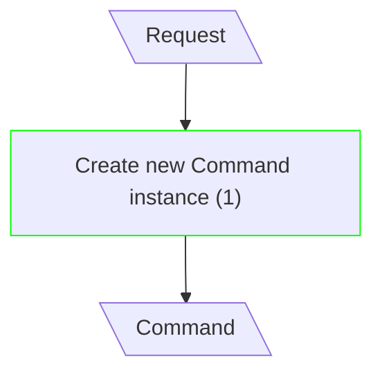
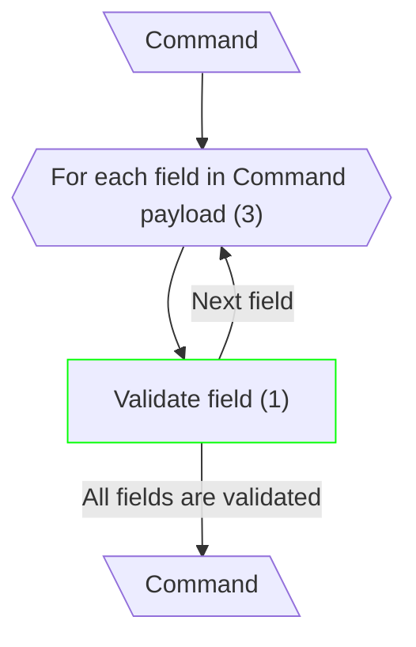
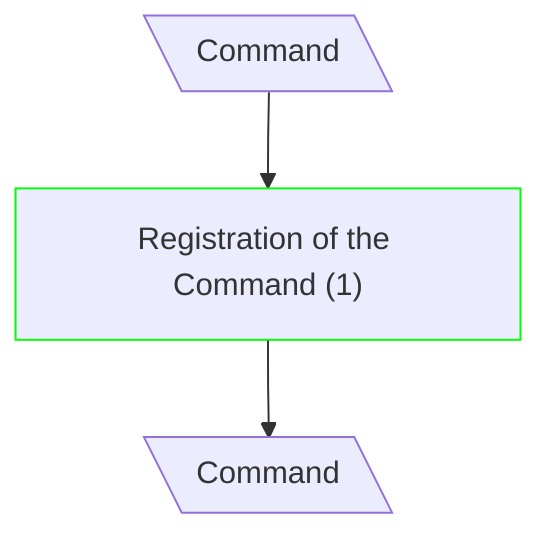
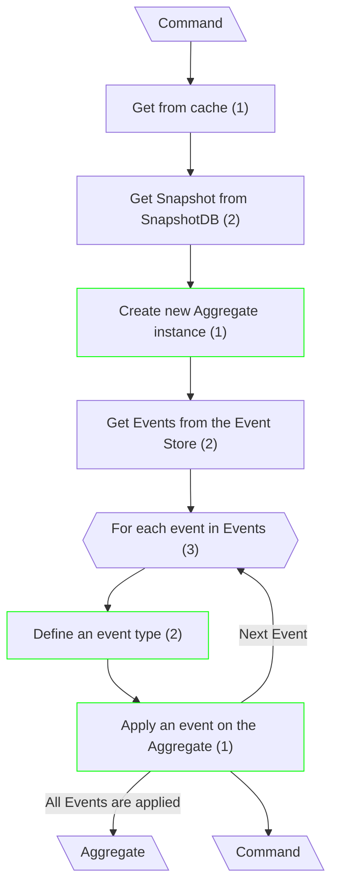
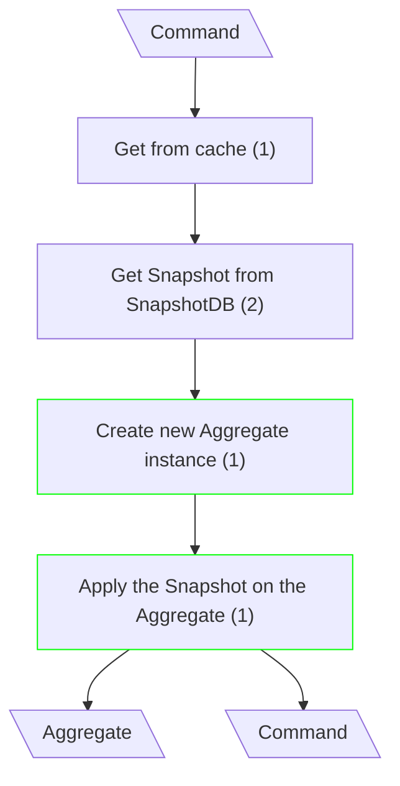
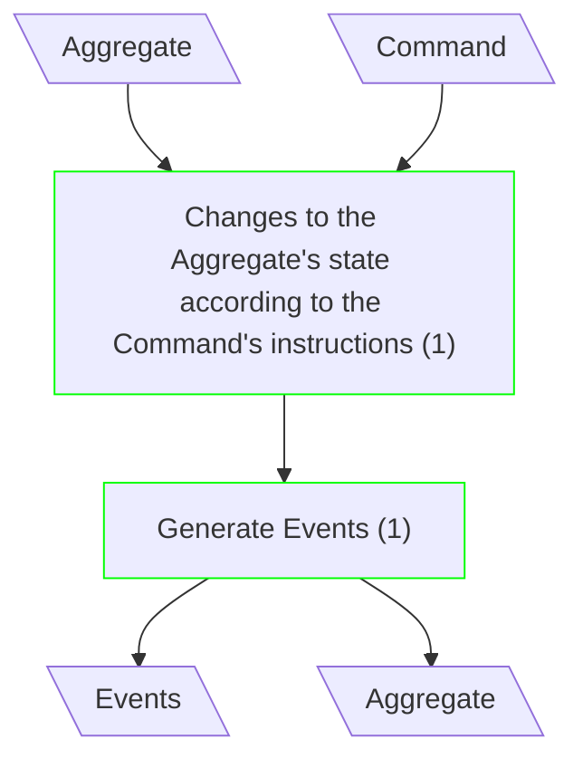
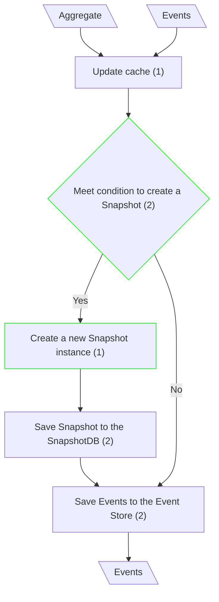
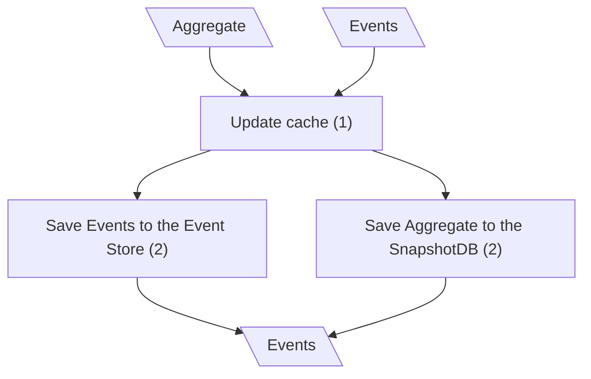
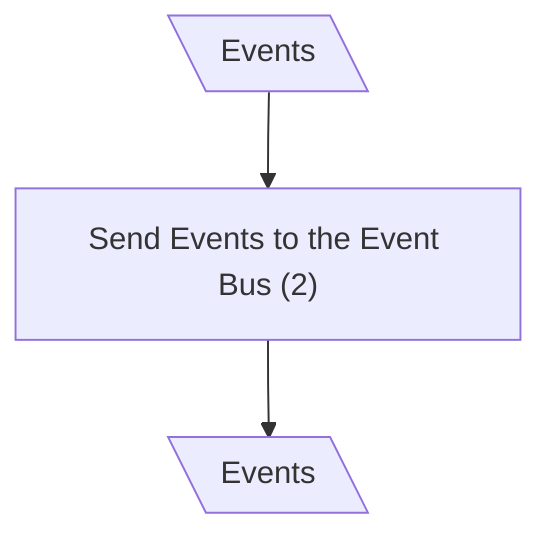

# Update Entity

## Create Command

**Input/Output Parameters:** Request, Command (2)

| ID    | Name                        | Type     | Weight |
|-------|-----------------------------|----------|--------|
| BCS1  | Create new Command instance | sequence | 1      |
| Total |                             |          | 1      |

**Implementation Complexity:** 2 × 1 = **2**  
**Modification Complexity:** 2 × 1 = **2**

---

## Validate Command

**Input/Output Parameters:** Command (1)

| ID    | Name                              | Type      | Weight |
|-------|-----------------------------------|-----------|--------|
| BCS1  | For each field in Command payload | iteration | 3      |
| BCS2  | Validate field                    | sequence  | 1      |
| Total |                                   |           | 4      |

**Implementation Complexity:** 1 × 4 = **4**  
**Modification Complexity:** 1 × 1 = **1**

---

## Route Command

**Input/Output Parameters:** Command (1)

| ID    | Name                        | Type     | Weight |
|-------|-----------------------------|----------|--------|
| BCS1  | Registration of the Command | sequence | 1      |
| Total |                             |          | 1      |

**Implementation Complexity:** 1 × 1 = **1**  
**Modification Complexity:** 1 × 1 = **1**

---

## Fetch the Aggregate (Classical CQRS)

**Input/Output Parameters:** Command, Aggregate (2)

| ID    | Name                                | Type          | Weight |
|-------|-------------------------------------|---------------|--------|
| BCS1  | Get from cache                      | sequence      | 1      |
| BCS2  | Get Snapshot from SnapshotDB        | function call | 2      |
| BCS3  | Create new Aggregate instance       | sequence      | 1      |
| BCS4  | Get Events from the Event Store     | function call | 2      |
| BCS5  | For each event in Events            | iteration     | 3      |
| BCS6  | Define an event type                | branch        | 2      |
| BCS7  | Apply an event on the Aggregate     | sequence      | 1      |
| Total |                                     |               | 12     |

**Implementation Complexity:** 2 × 12 = **24**  
**Modification Complexity:** 2 × 4 = **8**

---

## Fetch the Aggregate (mCQRS)

**Input/Output Parameters:** Command, Aggregate (2)

| ID    | Name                                  | Type          | Weight |
|-------|---------------------------------------|---------------|--------|
| BCS1  | Get from cache                        | sequence      | 1      |
| BCS2  | Get Snapshot from SnapshotDB          | function call | 2      |
| BCS3  | Create new Aggregate instance         | sequence      | 1      |
| BCS4  | Apply the Snapshot on the Aggregate   | sequence      | 1      |
| Total |                                       |               | 5      |

**Implementation Complexity:** 2 × 5 = **10**  
**Modification Complexity:** 2 × 2 = **4**

---

## Update Aggregate's State

**Input/Output Parameters:** Aggregate, Command, Events (3)

| ID    | Name                                                                      | Type     | Weight |
|-------|---------------------------------------------------------------------------|----------|--------|
| BCS1  | Changes to the Aggregate's state according to the Command's instructions  | sequence | 1      |
| BCS2  | Generate Events                                                           | sequence | 1      |
| Total |                                                                           |          | 2      |

**Implementation Complexity:** 3 × 2 = **6**  
**Modification Complexity:** 3 × 2 = **6**

---

## Save Aggregate (Classical CQRS)

**Input/Output Parameters:** Aggregate, Events (2)

| ID    | Name                                | Type          | Weight |
|-------|-------------------------------------|---------------|--------|
| BCS1  | Update cache                        | sequence      | 1      |
| BCS2  | Meet condition to create a Snapshot | branch        | 2      |
| BCS3  | Create a new Snapshot instance      | sequence      | 1      |
| BCS4  | Save Events to the Event Store      | function call | 2      |
| BCS5  | Save Snapshot to the SnapshotDB     | function call | 2      |
| Total |                                     |               | 8      |

**Implementation Complexity:** 2 × 8 = **16**  
**Modification Complexity:** 2 × 3 = **6**

---

## Save Aggregate (mCQRS)

**Input/Output Parameters:** Aggregate, Events (2)

| ID    | Name                             | Type          | Weight |
|-------|----------------------------------|---------------|--------|
| BCS1  | Update cache                     | sequence      | 1      |
| BCS2  | Save Events to the Event Store   | function call | 2      |
| BCS3  | Save Aggregate to the SnapshotDB | function call | 2      |
| Total |                                  |               | 5      |

**Implementation Complexity:** 2 × 5 = **10**  
**Modification Complexity:** 2 × 0 = **0**

---

## Dispatch Events

**Input/Output Parameters:** Events (1)

| ID    | Name                         | Type          | Weight |
|-------|------------------------------|---------------|--------|
| BCS1  | Send Events to the Event Bus | function call | 2      |
| Total |                              |               | 2      |

**Implementation Complexity:** 1 × 2 = **2**  
**Modification Complexity:** 1 × 0 = **0**
