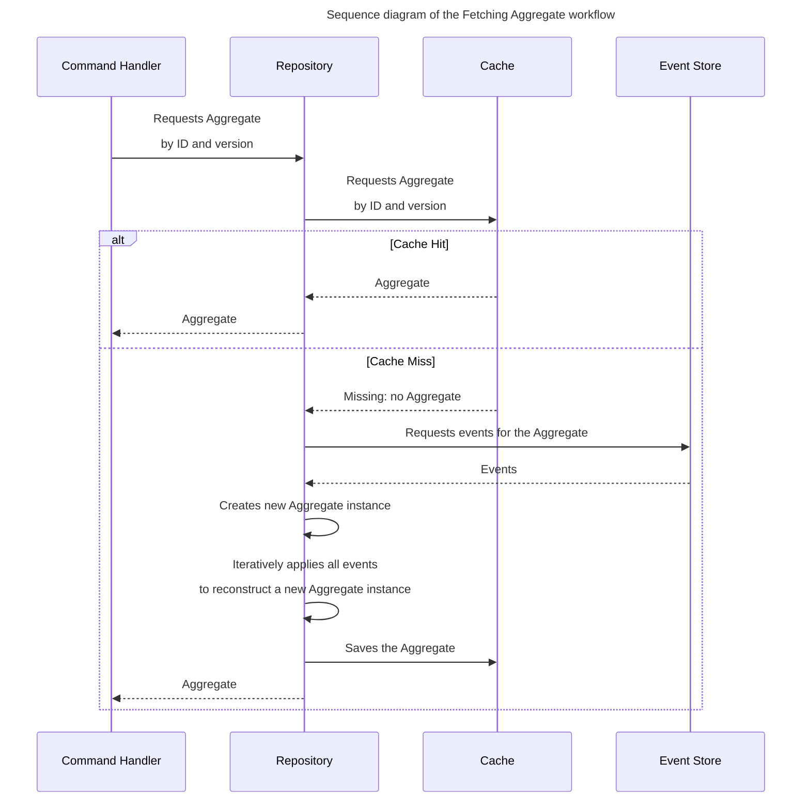
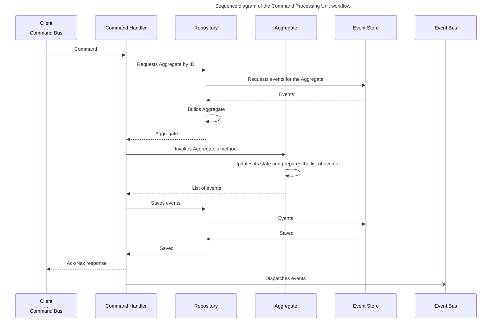
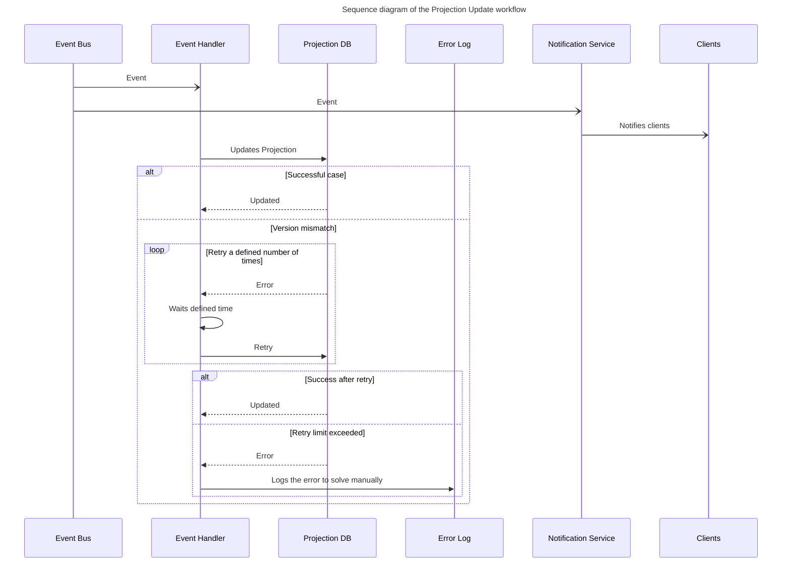
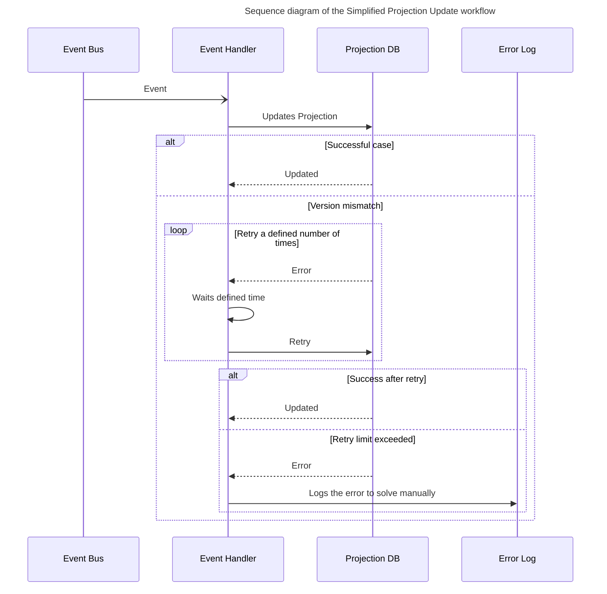
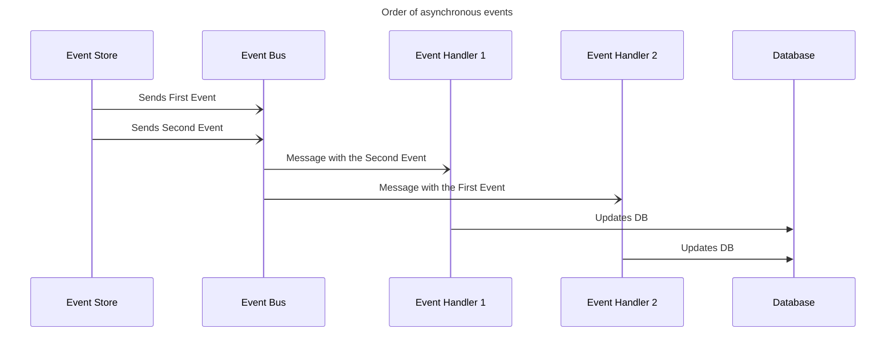
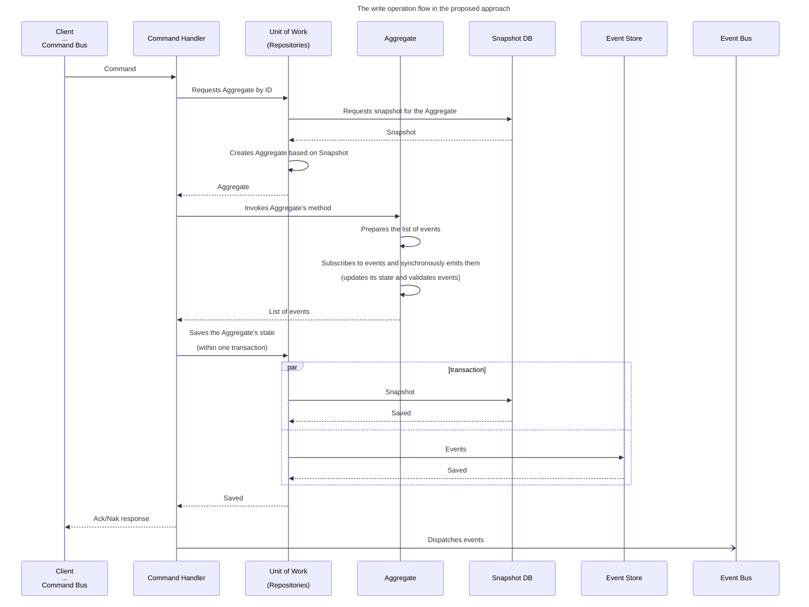
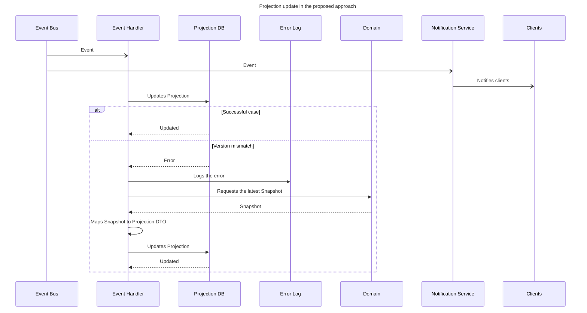
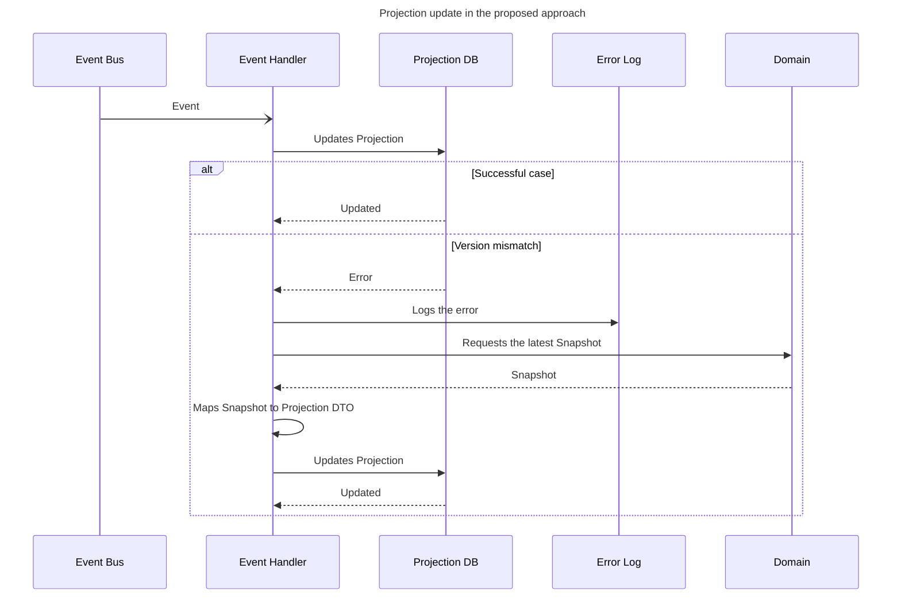

```mermaid
---
title: Sequence diagram of the Fetching Aggregate workflow
config:
  sequence:
    width: 200
    height: 80
    actorMargin: 60
    boxMargin: 15
    messageMargin: 45
---
  sequenceDiagram 
    participant ch as Command Handler
    participant r as Repository
    participant c as Cache
    participant es as Event Store

    ch->>r: Requests Aggregate<br><br>by ID and version
    r ->> c: Requests Aggregate<br><br>by ID and version
    
    alt Cache Hit
      c -->> r: Aggregate
      r -->> ch: Aggregate
    else Cache Miss
      c -->> r: Missing: no Aggregate
      r->>es: Requests events for the Aggregate
      es-->>r: Events
      r->>r: Creates new Aggregate instance
      r->>r: Iteratively applies all events<br><br>to reconstruct a new Aggregate instance
      r ->> c: Saves the Aggregate
      r-->>ch: Aggregate
    end
```

```mermaid
---
title: Sequence diagram of the Command Processing Unit workflow
config:
  sequence:
    width: 200
    height: 80
    actorMargin: 60
    boxMargin: 15
    messageMargin: 45
---
  sequenceDiagram 
    participant c as Client<br>...<br>Command Bus
    participant ch as Command Handler
    participant r as Repository
    participant a as Aggregate
    participant es as Event Store
    participant eb as Event Bus

    c->>ch: Command
    ch->>r: Requests Aggregate by ID
    r->>es: Requests events for the Aggregate
    es-->>r: Events
    r->>r: Builds Aggregate
    r-->>ch: Aggregate
    ch->>a: Invokes Aggregate's method
    a->>a: Updates its state and prepares the list of events
    a-->>ch: List of events
    ch->>r: Saves events
    r->>es: Events
    es-->>r: Saved
    r-->>ch: Saved
    ch-->>c: Ack/Nak response
    ch-)eb: Dispatches events
```

```mermaid
---
title: Sequence diagram of the Projection Update workflow
config:
  sequence:
    width: 200
    height: 80
    actorMargin: 60
    boxMargin: 15
    messageMargin: 45
---
  sequenceDiagram 
    participant eb as Event Bus
    participant eh as Event Handler
    participant db as Projection DB
    participant el as Error Log
    participant ns as Notification Service
    participant c as Clients

    eb-)eh: Event
    eb-)ns: Event
    ns-)c: Notifies clients
    eh->>db: Updates Projection
    alt Successful case
        db-->>eh: Updated
    else Version mismatch
      loop Retry a defined number of times
        db-->>eh: Error
        eh->>eh: Waits defined time
        eh->>db: Retry
      end
      alt Success after retry
        db-->>eh: Updated
      else Retry limit exceeded
        db-->>eh: Error
        eh->>el: Logs the error to solve manually
      end  
    end
```

```mermaid
---
title: Sequence diagram of the Simplified Projection Update workflow
config:
  sequence:
    width: 200
    height: 80
    actorMargin: 60
    boxMargin: 15
    messageMargin: 45
---
  sequenceDiagram 
    participant eb as Event Bus
    participant eh as Event Handler
    participant db as Projection DB
    participant el as Error Log

    eb-)eh: Event
    eh->>db: Updates Projection
    alt Successful case
        db-->>eh: Updated
    else Version mismatch
      loop Retry a defined number of times
        db-->>eh: Error
        eh->>eh: Waits defined time
        eh->>db: Retry
      end
      alt Success after retry
        db-->>eh: Updated
      else Retry limit exceeded
        db-->>eh: Error
        eh->>el: Logs the error to solve manually
      end  
    end
```

```mermaid
---
title: Order of asynchronous events
config:
  sequence:
    width: 200
    height: 80
    actorMargin: 80
    boxMargin: 15
---
  sequenceDiagram
    participant es as Event Store
    participant eb as Event Bus
    participant deh as Event Handler 1
    participant weh as Event Handler 2
    participant d as Database

    es-)eb: Sends First Event
    es-)eb: Sends Second Event
    eb-)deh: Message with the Second Event 
    eb-)weh: Message with the First Event 
    deh->>d: Updates DB 
    weh->>d: Updates DB 
```

```mermaid
---
title: The write operation flow in the proposed approach
config:
  sequence:
    width: 200
    height: 80
    actorMargin: 60
    boxMargin: 15
    messageMargin: 45
---
  sequenceDiagram 
    participant c as Client<br>...<br>Command Bus
    participant ch as Command Handler
    participant r as Unit of Work<br><br>(Repositories)
    participant a as Aggregate
    participant sdb as Snapshot DB
    participant es as Event Store
    participant eb as Event Bus

    c->>ch: Command
    ch->>r: Requests Aggregate by ID
    r->>sdb: Requests snapshot for the Aggregate
    sdb-->>r: Snapshot
    r->>r: Creates Aggregate based on Snapshot
    r-->>ch: Aggregate
    ch->>a: Invokes Aggregate's method
    a->>a: Prepares the list of events
    a->>a: Subscribes to events and synchronously emits them<br><br>(updates its state and validates events)
    a-->>ch: List of events
    ch->>r: Saves the Aggregate's state<br><br>(within one transaction)
    par transaction
        r->>sdb: Snapshot
        sdb-->>r: Saved
    and
        r->>es: Events
        es-->>r: Saved
    end
    r-->>ch: Saved
    ch-->>c: Ack/Nak response
    ch-)eb: Dispatches events
```

```mermaid
---
title: Projection update in the proposed approach
config:
  sequence:
    width: 200
    height: 80
    actorMargin: 60
    boxMargin: 15
    messageMargin: 45
---
sequenceDiagram
    participant eb as Event Bus
    participant eh as Event Handler
    participant db as Projection DB
    participant el as Error Log
    participant d as Domain
    participant ns as Notification Service
    participant c as Clients

    eb-)eh: Event
    eb-)ns: Event
    ns-)c: Notifies clients
        eh->>db: Updates Projection
    alt Successful case
        db-->>eh: Updated
    else Version mismatch
        db-->>eh: Error
        eh->>el: Logs the error
        eh->>d: Requests the latest Snapshot
        d-->>eh: Snapshot
        eh->>eh: Maps Snapshot to Projection DTO
        eh->>db: Updates Projection
        db-->>eh: Updated
    end
```

```mermaid
---
title: Projection update in the proposed approach
config:
  sequence:
    width: 200
    height: 80
    actorMargin: 60
    boxMargin: 15
    messageMargin: 45
---
sequenceDiagram
    participant eb as Event Bus
    participant eh as Event Handler
    participant db as Projection DB
    participant el as Error Log
    participant d as Domain

    eb-)eh: Event
    eh->>db: Updates Projection
    alt Successful case
        db-->>eh: Updated
    else Version mismatch
        db-->>eh: Error
        eh->>el: Logs the error
        eh->>d: Requests the latest Snapshot
        d-->>eh: Snapshot
        eh->>eh: Maps Snapshot to Projection DTO
        eh->>db: Updates Projection
        db-->>eh: Updated
    end
```