# Classical CQRS
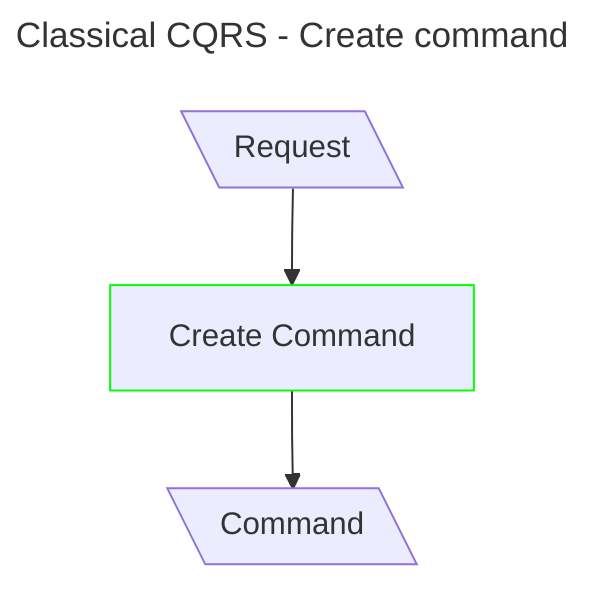
impl complexity: 2;
mod complexity: 2

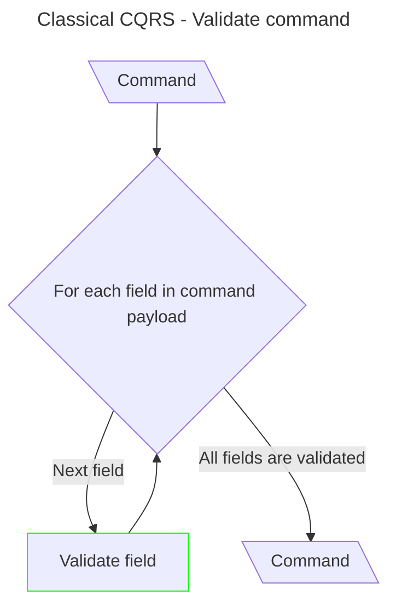
impl complexity: 8;
mod complexity: 2

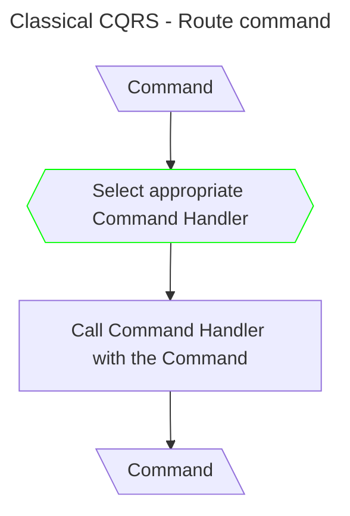
impl complexity: 8;
mod complexity: 4


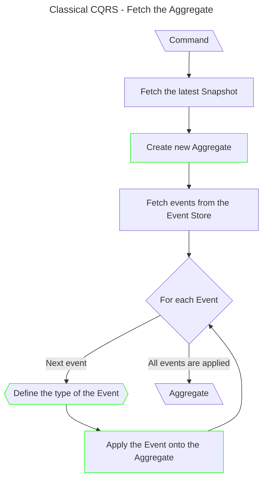
impl complexity: 22;
mod complexity: 8


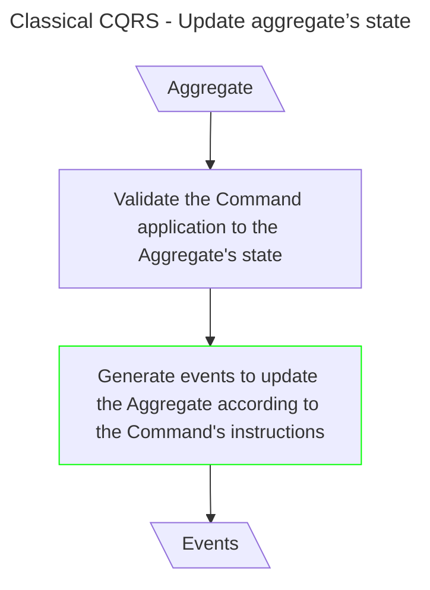
impl complexity: 8;
mod complexity: 4


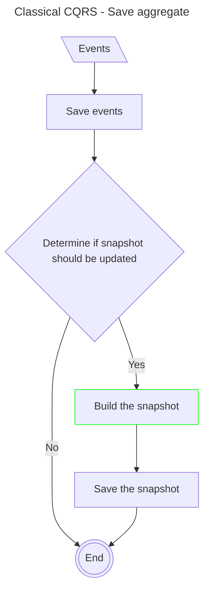
impl complexity: 7;
mod complexity: 1


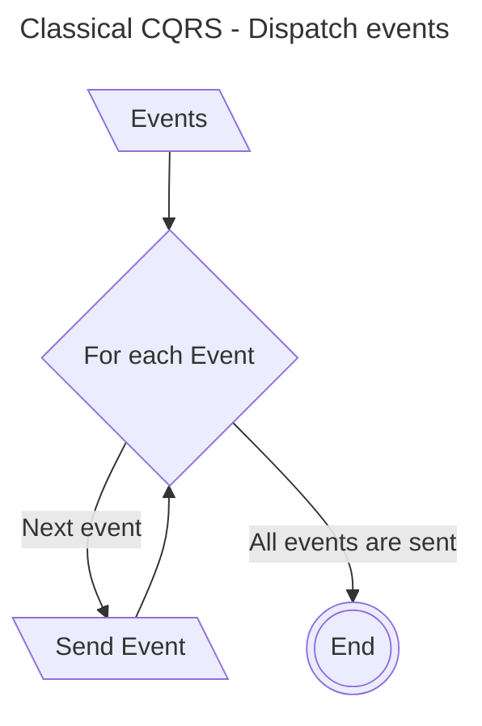
impl complexity: 6;
mod complexity: 0


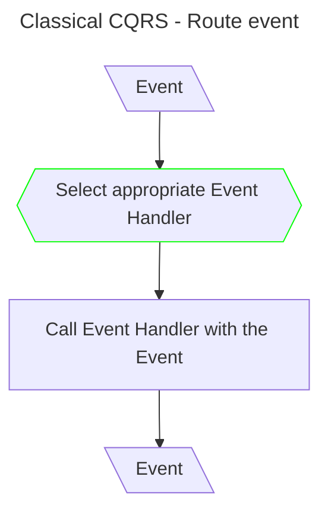
impl complexity: 8;
mod complexity: 4


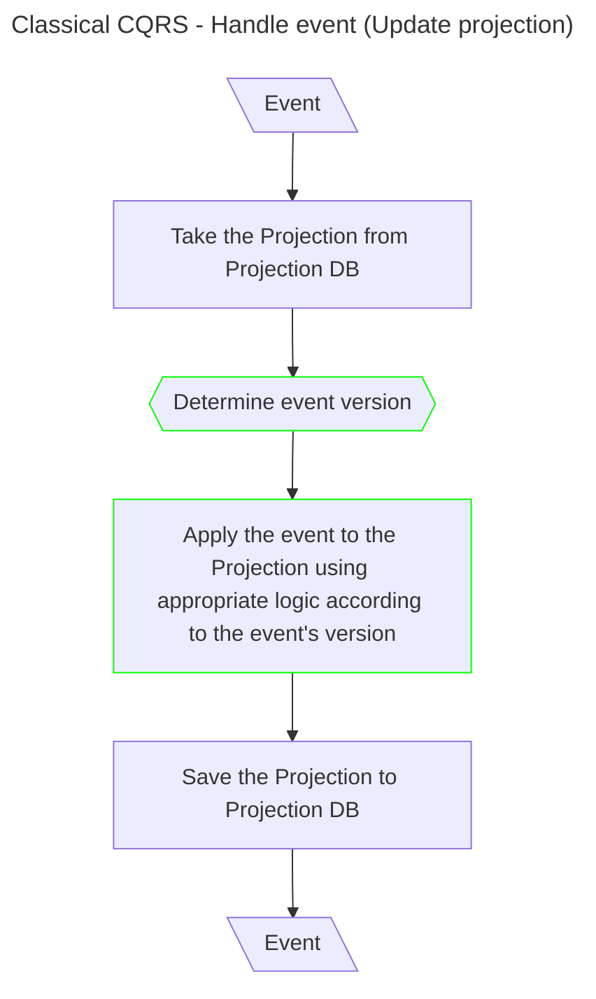
impl complexity: 14;
mod complexity: 6


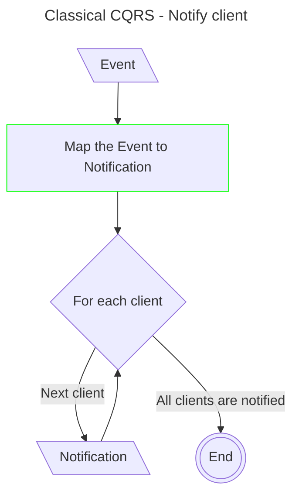
impl complexity: 12;
mod complexity: 2


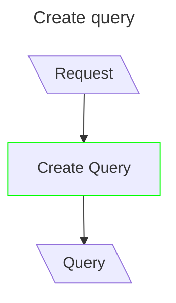
impl complexity: 2;
mod complexity: 2


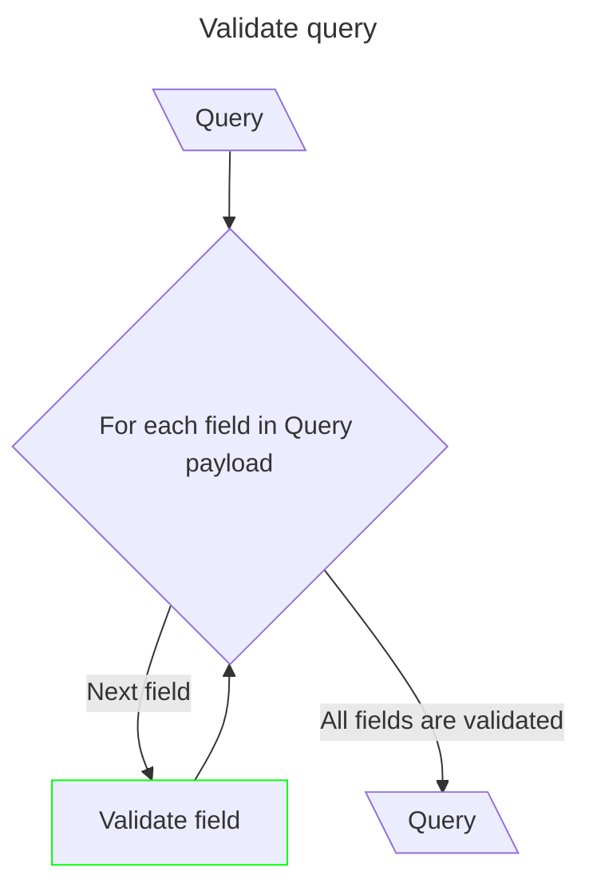
impl complexity: 8;
mod complexity: 2


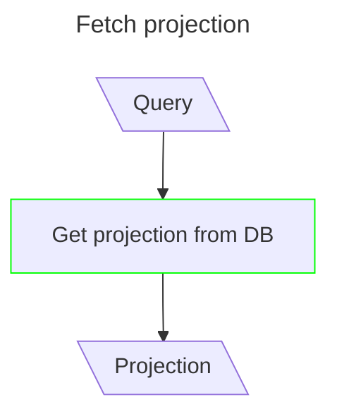
impl complexity: 4;
mod complexity: 4


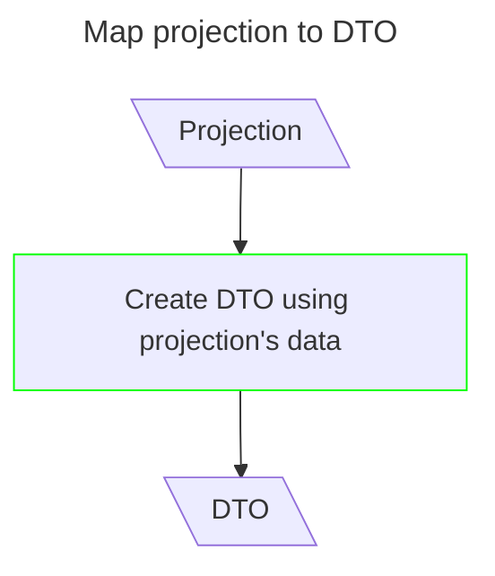
impl complexity: 2;
mod complexity: 2


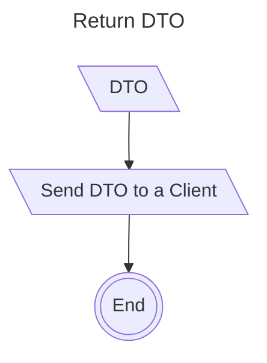
impl complexity: 2;
mod complexity: 0


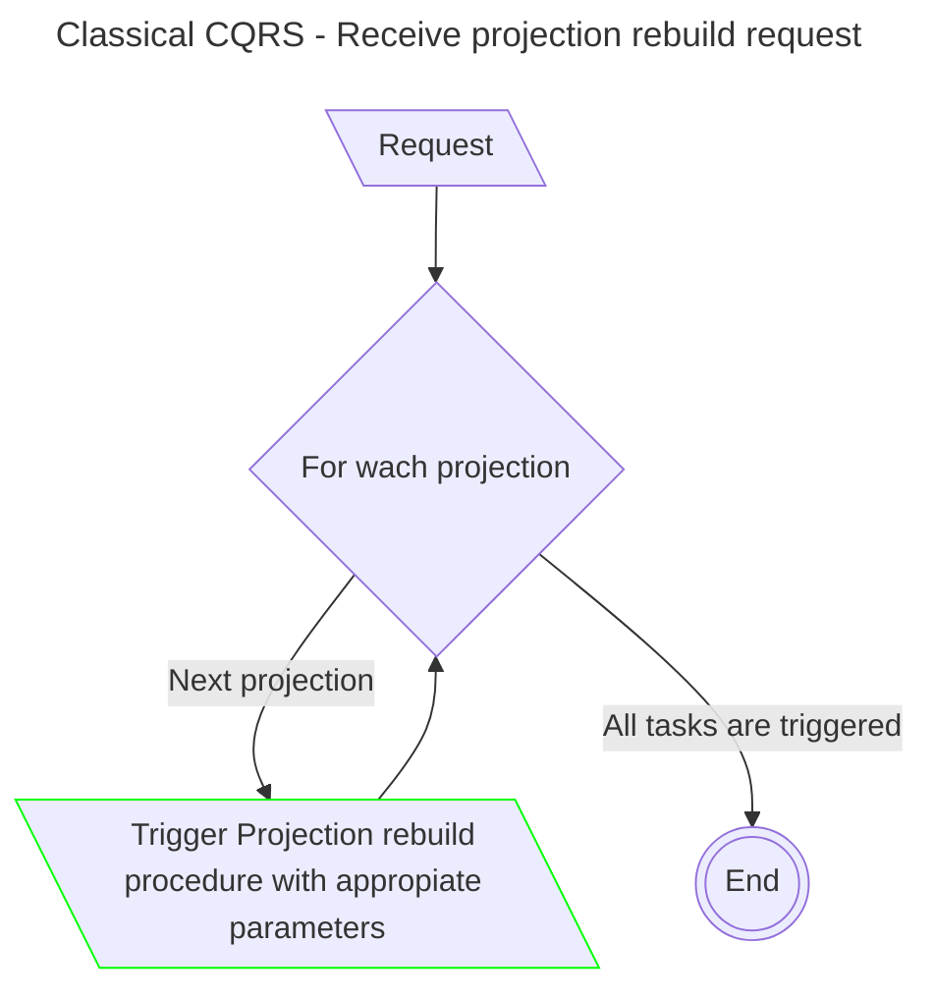
impl complexity: 8;
mod complexity: 2


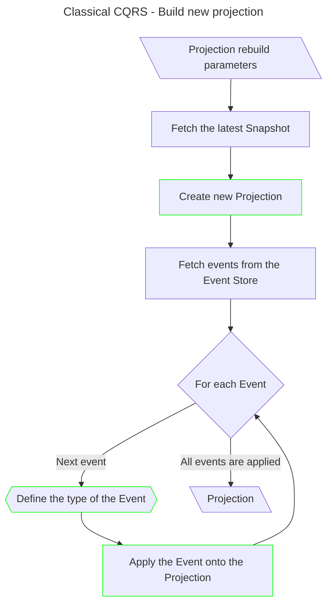
impl complexity: 22;
mod complexity: 8


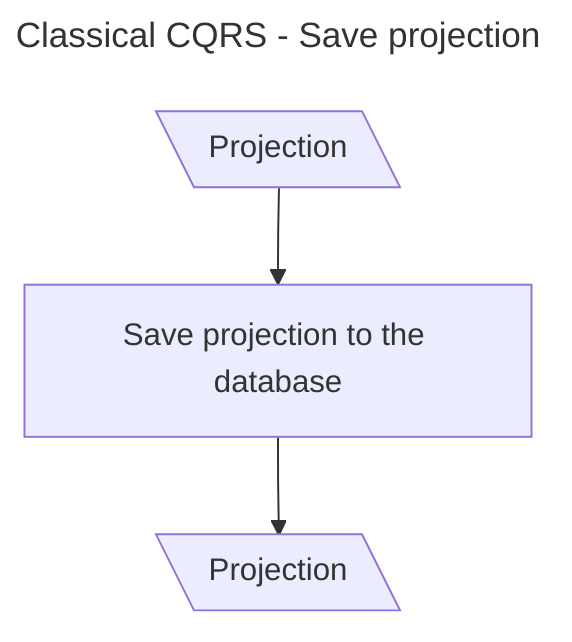
impl complexity: 4;
mod complexity: 0


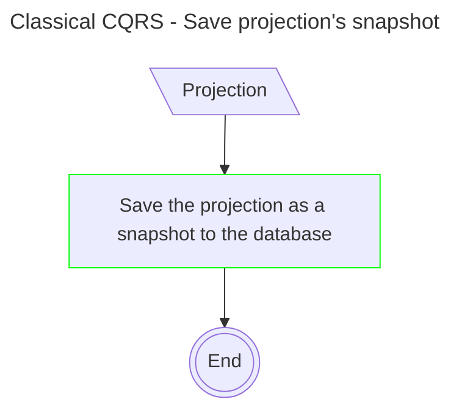
impl complexity: 2;
mod complexity: 0

# mCQRS
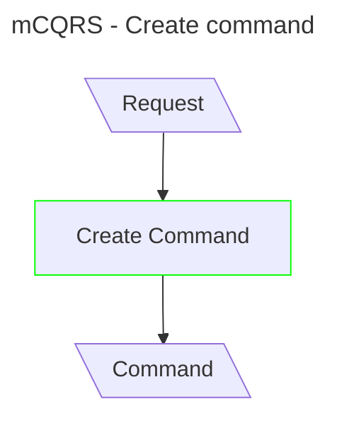
impl complexity: 2;
mod complexity: 2

```mermaid
---
title: mCQRS - Validate command
---
flowchart TD
  classDef mod stroke:#0f0
  A@{ shape: lean-l, label: "Command" }
  A --> B{For each field in command payload}
  B -->|Next field| C[Validate field]
  C:::mod --> B
  B -->|All fields are validated| E@{ shape: lean-l, label: "Command" }
```
impl complexity: 8;
mod complexity: 2

```mermaid
---
title: mCQRS - Route command
---
flowchart TD
  classDef mod stroke:#0f0
  A@{ shape: lean-l, label: "Command" }
  A --> B{{Select appropriate Command Handler}}
  B:::mod -->C[Call Command Handler with the Command]
  C --> D@{ shape: lean-l, label: "Command" }
```
impl complexity: 8;
mod complexity: 4


```mermaid
---
title: mCQRS - Fetch the Aggregate
---
flowchart TD
  classDef mod stroke:#0f0
  A@{ shape: lean-l, label: "Command" }
  A --> B[Fetch data from the Snapshot DB]
  B --> C[Create new Aggregate]:::mod
  C --> D[Map Snapshot data to the Aggregate]:::mod
  D --> H@{ shape: lean-l, label: "Aggregate" }
```
impl complexity: 8;
mod complexity: 4


```mermaid
---
title: mCQRS - Update aggregate’s state
---
flowchart TD
  classDef mod stroke:#0f0
  A@{ shape: lean-l, label: "Aggregate" }
  A --> B[Validate the Command application to the Aggregate's state]
  B --> C[Generate events to update the Aggregate according to the Command's instructions]:::mod
  C --> D@{ shape: lean-l, label: "Events" }
```
impl complexity: 8;
mod complexity: 4

```mermaid
---
title: mCQRS - Apply events onto aggregate
---
flowchart TD
  A@{ shape: lean-l, label: "Events" }
  A --> B[Create a new subscription for the Aggregate to Events]
  B --> C@{ shape: lean-l, label: "Events, Aggregate" }
```
impl complexity: 3;
mod complexity: 0


```mermaid
---
title: mCQRS - Save aggregate
---
flowchart TD
  classDef mod stroke:#0f0
  A@{ shape: lean-l, label: "Events, Aggregate" }
  A --> B[Save events]
  B --> C[Save the aggregate's state to Snapshot DB]
  C --> D@{ shape: dbl-circ, label: "End" }
```
impl complexity: 8;
mod complexity: 0


```mermaid
---
title: mCQRS - Dispatch events
---
flowchart TD
  classDef mod stroke:#0f0
  A@{ shape: lean-l, label: "Events" }
  A --> B{For each Event}
  B --> |Next event|C@{ shape: lean-l, label: "Send Event" }
  C --> B
  B --> |All events are sent|D@{ shape: dbl-circ, label: "End" }
```
impl complexity: 6;
mod complexity: 0


```mermaid
---
title: mCQRS - Route event
---
flowchart TD
  classDef mod stroke:#0f0
  A@{ shape: lean-l, label: "Event" }
  A --> B{{Select appropriate Event Handler}}
  B:::mod -->C[Call Event Handler with the Event]
  C --> D@{ shape: lean-l, label: "Event" }
```
impl complexity: 8;
mod complexity: 4


```mermaid
---
title: mCQRS - Handle event (Update projection)
---
flowchart TD
  classDef mod stroke:#0f0
  A@{ shape: lean-l, label: "Event" }
  A --> B[Take data from Snapshot DB]
  B --> C[Map data to a new Projection]:::mod
  C --> D[Create new / update the Projection in the Projection DB]
  D --> E@{ shape: lean-l, label: "Event" }
```
impl complexity: 10;
mod complexity: 2


```mermaid
---
title: mCQRS - Notify client
---
flowchart TD
  classDef mod stroke:#0f0
  A@{ shape: lean-l, label: "Event" }
  A --> B[Map the Event to Notification]:::mod
  B --> C{For each client}
  C -->|Next client|D@{ shape: lean-l, label: "Notification" }
  D --> C
  C -->|All clients are notified|E@{ shape: dbl-circ, label: "End" }
```
impl complexity: 12;
mod complexity: 2


```mermaid
---
title: Create query
---
flowchart TD
  classDef mod stroke:#0f0
  A@{ shape: lean-l, label: "Request" }
  A --> B[Create Query]:::mod
  B --> C@{ shape: lean-l, label: "Query" }
```
impl complexity: 2;
mod complexity: 2


```mermaid
---
title: Validate query
---
flowchart TD
  classDef mod stroke:#0f0
  A@{ shape: lean-l, label: "Query" }
  A --> B{For each field in Query payload}
  B -->|Next field| C[Validate field]
  C:::mod --> B
  B -->|All fields are validated| E@{ shape: lean-l, label: "Query" }
```
impl complexity: 8;
mod complexity: 2


```mermaid
---
title: Fetch projection
---
flowchart TD
  classDef mod stroke:#0f0
  A@{ shape: lean-l, label: "Query" }
  A --> B[Get projection from DB]:::mod
  B --> C@{ shape: lean-l, label: "Projection" }
```
impl complexity: 4;
mod complexity: 4


```mermaid
---
title: Map projection to DTO
---
flowchart TD
  classDef mod stroke:#0f0
  A@{ shape: lean-l, label: "Projection" }
  A --> B[Create DTO using projection's data]:::mod
  B --> C@{ shape: lean-l, label: "DTO" }
```
impl complexity: 2;
mod complexity: 2


```mermaid
---
title: Return DTO
---
flowchart TD
  classDef mod stroke:#0f0
  A@{ shape: lean-l, label: "DTO" }
  A --> B@{ shape: lean-l, label: "Send DTO to a Client" }
  B --> C@{ shape: dbl-circ, label: "End" }
```
impl complexity: 2;
mod complexity: 0


```mermaid
---
title: mCQRS - Receive projection rebuild request
---
flowchart TD
  classDef mod stroke:#0f0
  A@{ shape: lean-l, label: "Request" }
  A --> B{For wach projection}
  B -->|Next projection| C@{ shape: lean-l, label: Trigger Projection rebuild procedure with appropiate parameters}
  C:::mod --> B
  B -->|All tasks are triggered| D@{ shape: dbl-circ, label: "End" }
```
impl complexity: 8;
mod complexity: 2


```mermaid
---
title: mCQRS - Build new projection
---
flowchart TD
  classDef mod stroke:#0f0
  A@{ shape: lean-l, label: "Projection rebuild parameters" }
  A --> B[Fetch data from the Snapshot DB]
  B --> C[Create new projection]:::mod
  C --> D[Map Snapshot data to the Projection]:::mod
  D --> H@{ shape: lean-l, label: "Projection" }
```
impl complexity: 8;
mod complexity: 4


```mermaid
---
title: mCQRS - Save projection
---
flowchart TD
  classDef mod stroke:#0f0
  A@{ shape: lean-l, label: "Projection" }
  A --> B[Save projection to the database]
  B --> C@{ shape: lean-l, label: "Projection" }
```
impl complexity: 4;
mod complexity: 0

# Transition Complexity
## Fetch aggregate

```mermaid
---
title: Pure CQRS - Fetch the Aggregate
---
flowchart TD
  classDef mod stroke:#f00
  A@{ shape: lean-l, label: "Command" }
  A --> C[Create new Aggregate]:::mod
  C --> D[Fetch events from the Event Store]
  D --> E{For each Event}
  E --> |Next event|F{{Define the type of the Event}}
  F --> G[Apply the Event onto the Aggregate]
  G --> E
  E --> |All events are applied|H@{ shape: lean-l, label: "Aggregate" }
```

```mermaid
---
title: Classical CQRS - Fetch the Aggregate
---
flowchart TD
  classDef mod stroke:#0f0
  A@{ shape: lean-l, label: "Command" }
  A --> B[Fetch the latest Snapshot]
  B --> C[Create new Aggregate based on Snapshot]:::mod
  C --> D[Fetch events from the Event Store]:::mod
  D --> E{For each Event}:::mod
  E --> |Next event|F{{Define the type of the Event}}:::mod
  F --> G[Apply the Event onto the Aggregate]:::mod
  G --> E
  E --> |All events are applied|H@{ shape: lean-l, label: "Aggregate" }
```

```mermaid
---
title: mCQRS - Fetch the Aggregate
---
flowchart TD
  classDef mod stroke:#f00
  A@{ shape: lean-l, label: "Command" }
  A --> B[Fetch data from the Snapshot DB]
  B --> C[Create new Aggregate]:::mod
  C --> D[Map Snapshot data to the Aggregate]:::mod
  D --> H@{ shape: lean-l, label: "Aggregate" }
```

## Apply events onto aggregate

```mermaid
---
title: mCQRS - Apply events onto aggregate
---
flowchart TD
  classDef mod stroke:#f00
  A@{ shape: lean-l, label: "Events" }
  A --> B[Create a new subscription for the Aggregate to Events]:::mod
  B --> C@{ shape: lean-l, label: "Events, Aggregate" }
```

## Save aggregate

```mermaid
---
title: Pure CQRS - Save aggregate
---
flowchart TD
  classDef mod stroke:#0f0
  A@{ shape: lean-l, label: "Events" }
  A --> B[Save events]
  B --> G@{ shape: dbl-circ, label: "End" }
```

```mermaid
---
title: Classical CQRS - Save aggregate
---
flowchart TD
  classDef mod stroke:#0f0
  A@{ shape: lean-l, label: "Events" }
  A:::mod --> B[Save events]
  B --> C{Determine if snapshot should be updated}:::mod
  C -->|Yes| D[Build the snapshot]:::mod
  C -->|No|G
  D --> E[Save the snapshot]:::mod
  E --> G@{ shape: dbl-circ, label: "End" }
```

```mermaid
---
title: mCQRS - Save aggregate
---
flowchart TD
  classDef mod stroke:#f00
  A@{ shape: lean-l, label: "Events, Aggregate" }
  A --> B[Save events]
  B --> C[Save the aggregate's state to Snapshot DB]:::mod
  C --> D@{ shape: dbl-circ, label: "End" }
```

## Handle update projection event

```mermaid
---
title: Pure CQRS - Handle event (Update projection)
---
flowchart TD
  classDef mod stroke:#f00
  A@{ shape: lean-l, label: "Event" }
  A --> B[Take the Projection from Projection DB]:::mod
  B --> C{{Determine event version}}:::mod
  C --> D[Apply the event to the Projection using appropriate logic according to the event's version]:::mod
  D --> E[Save the Projection to Projection DB]
  E --> F@{ shape: lean-l, label: "Event" }
```

```mermaid
---
title: Classical CQRS - Handle event (Update projection)
---
flowchart TD
  classDef mod stroke:#0f0
  A@{ shape: lean-l, label: "Event" }
  A --> B[Take the Projection from Projection DB]:::mod
  B --> C{{Determine event version}}:::mod
  C --> D[Apply the event to the Projection using appropriate logic according to the event's version]:::mod
  D --> E[Save the Projection to Projection DB]
  E --> F@{ shape: lean-l, label: "Event" }
```

```mermaid
---
title: mCQRS - Handle event (Update projection)
---
flowchart TD
  classDef mod stroke:#f00
  A@{ shape: lean-l, label: "Event" }
  A --> B[Take data from Snapshot DB]:::mod
  B --> C[Map data to a new Projection]:::mod
  C --> D[Create new / update the Projection in the Projection DB]
  D --> E@{ shape: lean-l, label: "Event" }
```

## Build new projection

```mermaid
---
title: Pure CQRS - Build new projection
---
flowchart TD
  classDef mod stroke:#f00
  A@{ shape: lean-l, label: "Projection rebuild parameters" }
  A --> C[Create new Projection]
  C --> D[Fetch events from the Event Store]:::mod
  D --> E{For each Event}:::mod
  E --> |Next event|F{{Define the type of the Event}}:::mod
  F --> G[Apply the Event onto the Projection]:::mod
  G --> E
  E --> |All events are applied|H@{ shape: lean-l, label: "Projection" }
```

```mermaid
---
title: Classical CQRS - Build new projection
---
flowchart TD
  classDef mod stroke:#0f0
  A@{ shape: lean-l, label: "Projection rebuild parameters" }
  A --> B[Fetch the latest Snapshot]
  B --> C[Create new Projection based on Snapshot]:::mod
  C --> D[Fetch events from the Event Store]:::mod
  D --> E{For each Event}:::mod
  E --> |Next event|F{{Define the type of the Event}}:::mod
  F --> G[Apply the Event onto the Projection]:::mod
  G --> E
  E --> |All events are applied|H@{ shape: lean-l, label: "Projection" }
```

```mermaid
---
title: mCQRS - Build new projection
---
flowchart TD
  classDef mod stroke:#f00
  A@{ shape: lean-l, label: "Projection rebuild parameters" }
  A --> B[Fetch data from the Snapshot DB]
  B --> C[Create new projection]:::mod
  C --> D[Map Snapshot data to the Projection]:::mod
  D --> H@{ shape: lean-l, label: "Projection" }
```
## Save projection
## Save projection snapshot
```mermaid
---
title: Classical CQRS - Save projection's snapshot
---
flowchart TD
  classDef mod stroke:#0f0
  A@{ shape: lean-l, label: "Projection" }
  A --> B[Save the projection as a snapshot to the database]:::mod
  B --> C@{ shape: dbl-circ, label: "End" }
```