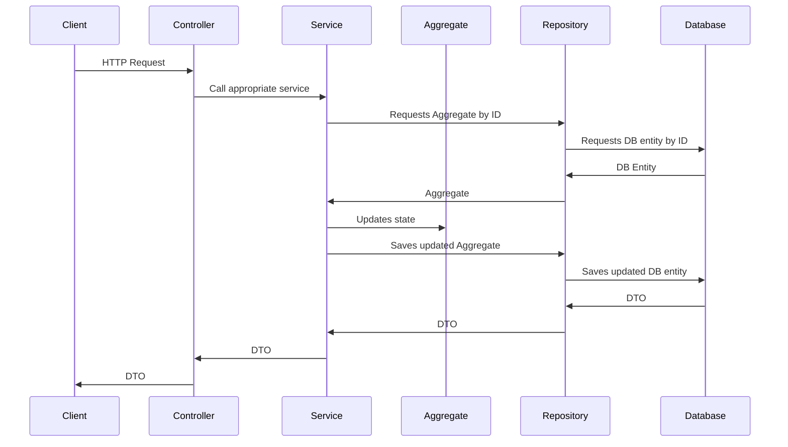
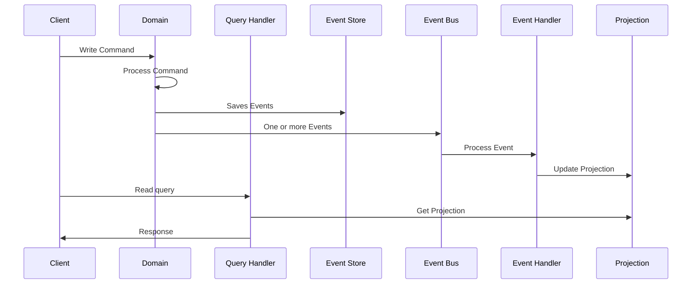

```mermaid
  sequenceDiagram
    participant c as Client
    participant clr as Controller
    participant s as Service
    participant a as Aggregate
    participant r as Repository
    participant db as Database

    c->>clr: HTTP Request
    clr->>s: Call appropriate service
    s->>r: Requests Aggregate by ID
    r->>db: Requests DB entity by ID
    db->>r: DB Entity 
    r->>s: Aggregate 
    s->>a: Updates state 
    s->>r: Saves updated Aggregate
    r->>db: Saves updated DB entity
    db->>r: DTO
    r->>s: DTO
    s->>clr: DTO
    clr->>c: DTO
```

```mermaid
  sequenceDiagram
    participant c as Client
    participant d as Domain
    participant qh as Query Handler
    participant es as Event Store
    participant eb as Event Bus
    participant eh as Event Handler
    participant p as Projection
 
    c->>d: Write Command
    d->>d: Process Command
    d->>es: Saves Events
    d->>eb: One or more Events
    eb->>eh: Process Event
    eh->>p: Update Projection
    c->>qh: Read query
    qh->>p: Get Projection
    qh->>c: Response
```
