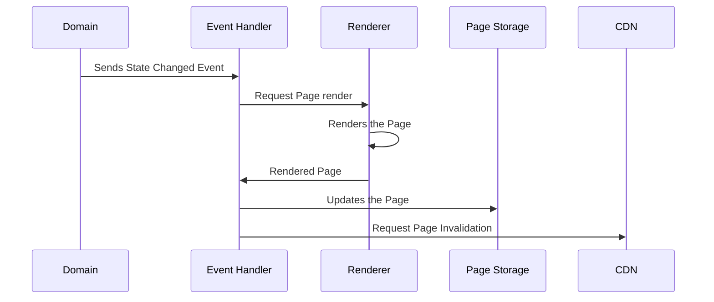
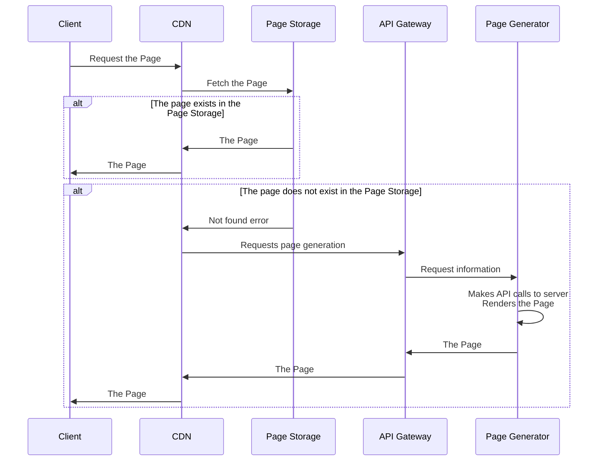
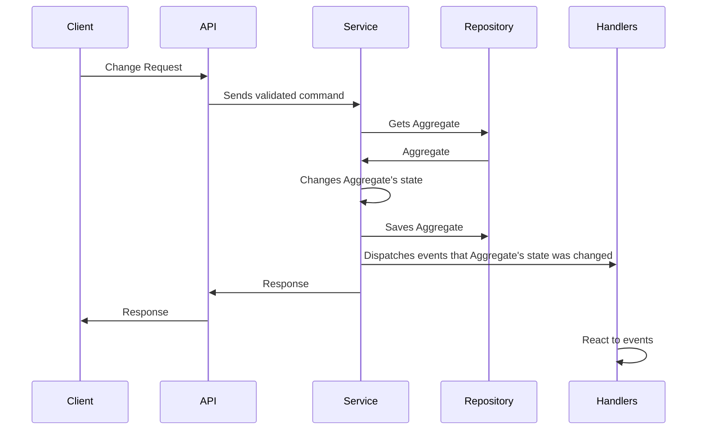
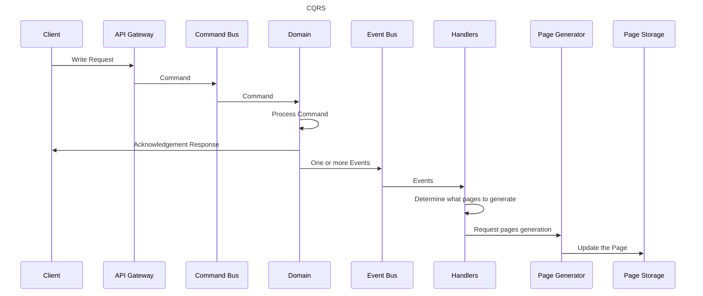

```mermaid
  sequenceDiagram
    participant d as Domain
    participant eh as Event Handler
    participant r as Renderer
    participant ps as Page  Storage
    participant cdn as CDN

    d->>eh: Sends State Changed Event
    eh->>r: Request Page render 
    r->>r: Renders the Page 
    r->>eh: Rendered Page 
    eh->>ps: Updates the Page 
    eh->>cdn: Request Page Invalidation
```

```mermaid
  sequenceDiagram
    participant c as Client
    participant cdn as CDN
    participant ps as Page  Storage
    participant apig as API Gateway
    participant pg as Page Generator

    c->>cdn: Request the Page 
    cdn->>ps: Fetch the Page 
    alt The page exists in the Page Storage
    ps->>cdn: The Page 
    cdn->>c: The Page 
    end
    alt The page does not exist in the Page Storage
        ps->>cdn: Not found error
        cdn ->> apig: Requests page generation
        apig ->> pg: Request information
        pg ->> pg: Makes API calls to server<br>Renders the Page
        pg ->> apig: The Page
        apig ->> cdn: The Page
        cdn ->> c: The Page
    end
```

```mermaid
  sequenceDiagram
    participant c as Client
    participant api as API
    participant svc as Service
    participant r as Repository
    participant h as Handlers

    c->>api: Change Request 
    api->>svc: Sends validated command
    svc->>r: Gets Aggregate
    r->>svc: Aggregate
    svc->>svc: Changes Aggregate's state
    svc->>r: Saves Aggregate
    svc->>h: Dispatches events that Aggregate's state was changed
    svc->>api: Response
    api->>c: Response
    h->>h: React to events
```

```mermaid
---
title: CQRS
---
  sequenceDiagram 
    participant c as Client
    participant api as API Gateway
    participant cb as Command Bus
    participant d as Domain
    participant eb as Event Bus
    participant h as Handlers
    participant pg as Page Generator
    participant ps as Page Storage

    c->>api: Write Request
    api->>cb: Command
    cb->>d: Command
    d->>d: Process Command
    d->>c: Acknowledgement Response 
    d->>eb: One or more Events
    eb->>h: Events
    h->>h: Determine what pages to generate
    h->>pg: Request pages generation
    pg->>ps: Update the Page
```
