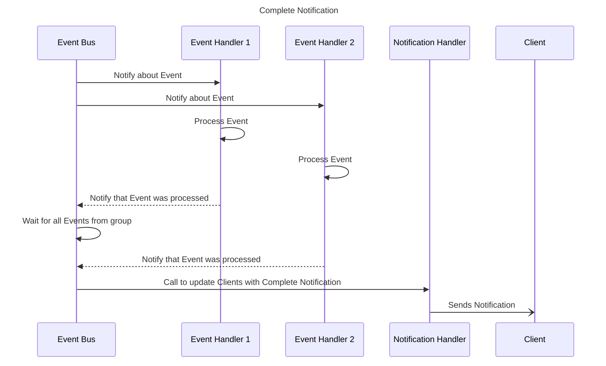
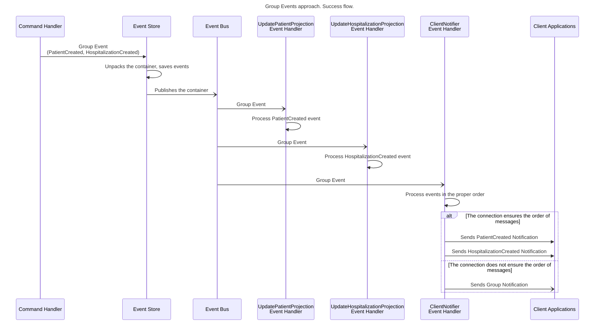
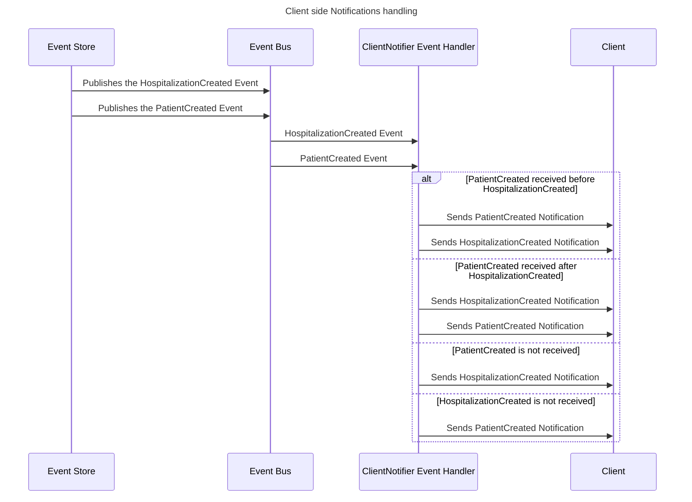
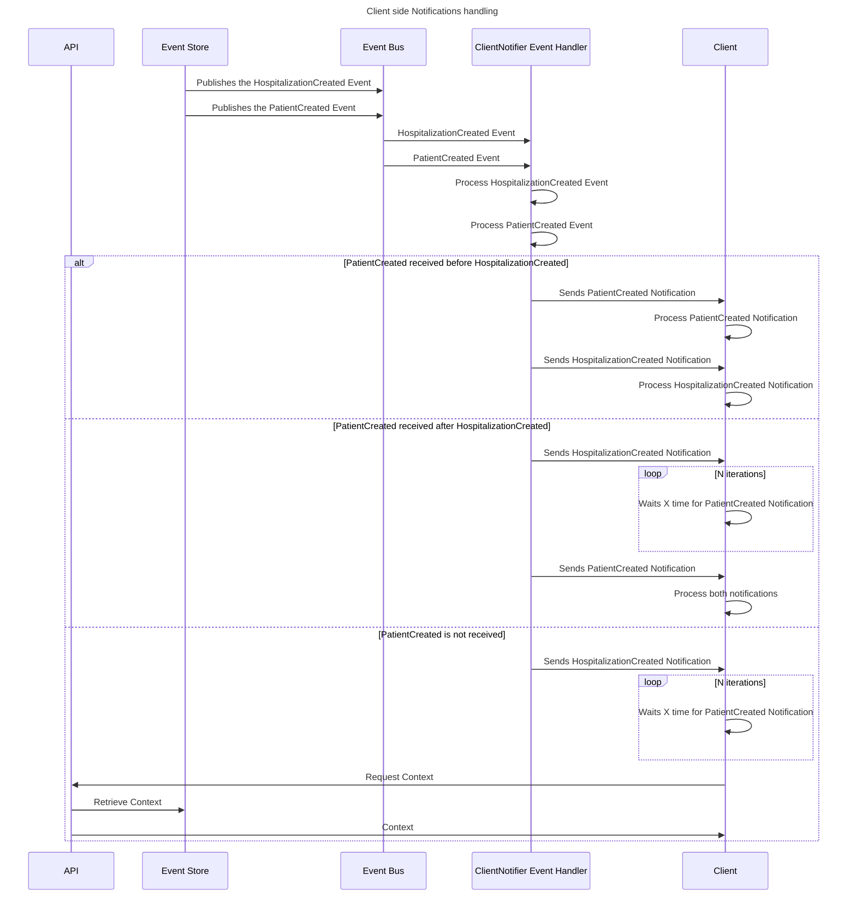
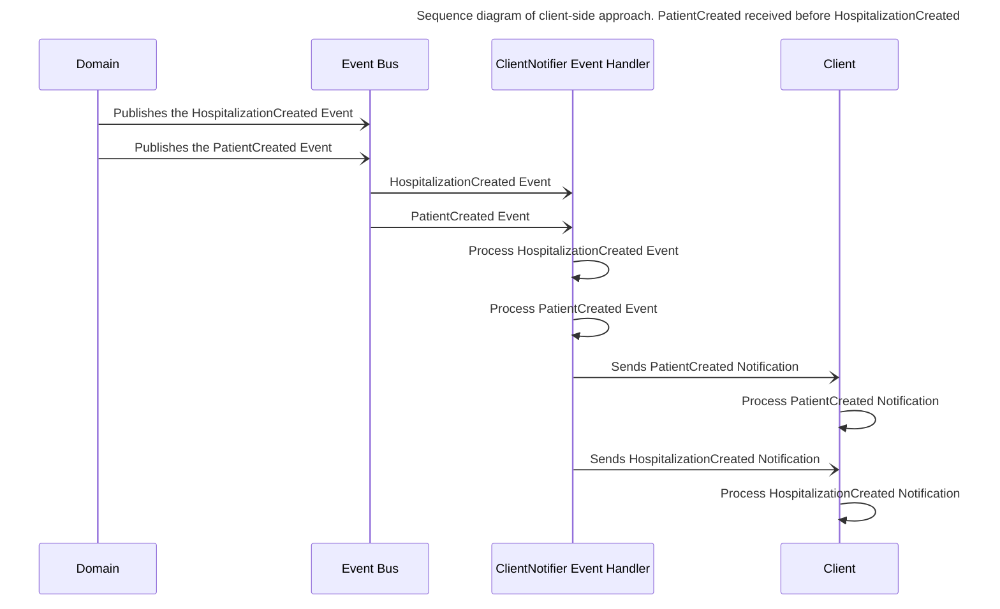
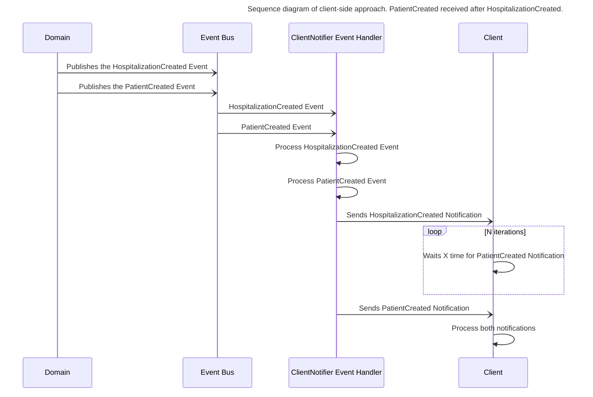
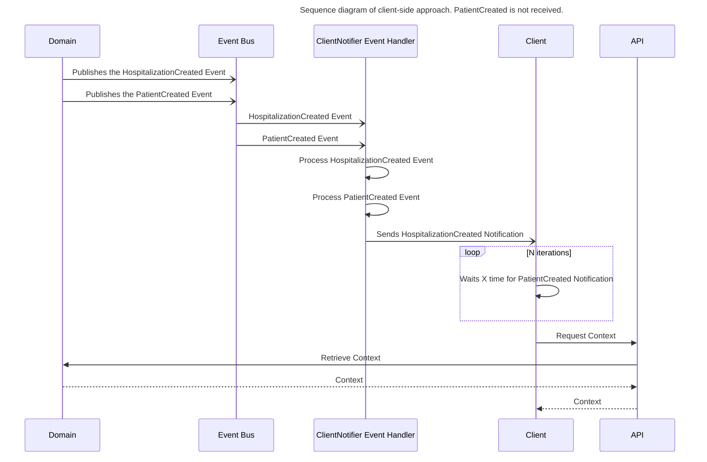
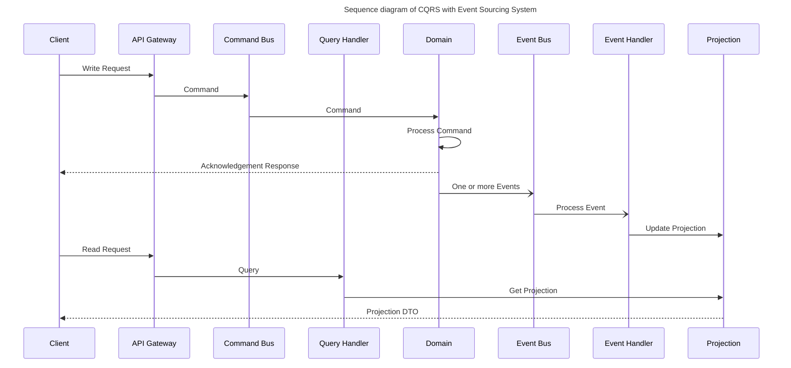

```mermaid
---
title: Complete Notification
---
  sequenceDiagram
    participant eb as Event Bus
    participant eh1 as Event Handler 1
    participant eh2 as Event Handler 2
    participant nh as Notification Handler
    participant c as Client

    eb->>eh1: Notify about Event
    eb->>eh2: Notify about Event
    eh1->>eh1: Process Event
    eh2->>eh2: Process Event
    eh1-->>eb: Notify that Event was processed
    eb->>eb: Wait for all Events from group
    eh2-->>eb: Notify that Event was processed
    eb->>nh: Call to update Clients with Complete Notification
    nh-)c: Sends Notification
```

```mermaid
---
title: Group Events approach. Success flow.
---
  sequenceDiagram
    participant cp as Command Handler
    participant es as Event Store
    participant eb as Event Bus
    participant gceh as UpdatePatientProjection<br />Event Handler
    participant bceh as UpdateHospitalizationProjection<br />Event Handler
    participant bcgeh as ClientNotifier<br />Event Handler
    participant c as Client Applications

    cp ->> es: Group Event<br />(PatientCreated, HospitalizationCreated)
    es ->> es: Unpacks the container, saves events
    es -) eb: Publishes the container
    eb -) gceh: Group Event
    gceh ->> gceh: Process PatientCreated event
    eb -) bceh: Group Event
    bceh ->> bceh: Process HospitalizationCreated event
    eb -) bcgeh: Group Event
    bcgeh ->> bcgeh: Process events in the proper order
    alt The connection ensures the order of messages
        bcgeh ->> c: Sends PatientCreated Notification
        bcgeh ->> c: Sends HospitalizationCreated Notification
    else The connection does not ensure the order of messages
        bcgeh -) c: Sends Group Notification
    end
```

```mermaid
---
title: Client side Notifications handling
---
  sequenceDiagram
    participant es as Event Store
    participant eb as Event Bus
    participant bcgeh as ClientNotifier Event Handler
    participant c as Client

    es ->> eb: Publishes the HospitalizationCreated Event
    es ->> eb: Publishes the PatientCreated Event
    eb ->> bcgeh: HospitalizationCreated Event
    eb ->> bcgeh: PatientCreated Event

    alt PatientCreated received before HospitalizationCreated
        bcgeh ->> c: Sends PatientCreated Notification
        bcgeh ->> c: Sends HospitalizationCreated Notification
    else PatientCreated received after HospitalizationCreated
        bcgeh ->> c: Sends HospitalizationCreated Notification
        bcgeh ->> c: Sends PatientCreated Notification
    else PatientCreated is not received
        bcgeh ->> c: Sends HospitalizationCreated Notification
    else HospitalizationCreated is not received
        bcgeh ->> c: Sends PatientCreated Notification
    end
```

```mermaid
---
title: Client side Notifications handling
---
  sequenceDiagram
    participant api as API
    participant es as Event Store
    participant eb as Event Bus
    participant bcgeh as ClientNotifier Event Handler
    participant c as Client

    es ->> eb: Publishes the HospitalizationCreated Event
    es ->> eb: Publishes the PatientCreated Event
    eb ->> bcgeh: HospitalizationCreated Event
    eb ->> bcgeh: PatientCreated Event
    bcgeh ->> bcgeh: Process HospitalizationCreated Event
    bcgeh ->> bcgeh: Process PatientCreated Event

    alt PatientCreated received before HospitalizationCreated
        bcgeh ->> c: Sends PatientCreated Notification
        c ->> c: Process PatientCreated Notification
        bcgeh ->> c: Sends HospitalizationCreated Notification
        c ->> c: Process HospitalizationCreated Notification
    else PatientCreated received after HospitalizationCreated
        bcgeh ->> c: Sends HospitalizationCreated Notification
        loop N iterations
            c ->> c: Waits X time for PatientCreated Notification
        end
        bcgeh ->> c: Sends PatientCreated Notification
        c ->> c: Process both notifications
    else PatientCreated is not received
        bcgeh ->> c: Sends HospitalizationCreated Notification
        loop N iterations
            c ->> c: Waits X time for PatientCreated Notification
        end
        c ->> api: Request Context
        api ->> es: Retrieve Context
        api ->> c: Context
    end
```

```mermaid
---
title: Sequence diagram of client-side approach. PatientCreated received before HospitalizationCreated
---
  sequenceDiagram
    participant es as Domain
    participant eb as Event Bus
    participant bcgeh as ClientNotifier Event Handler
    participant c as Client

    es -) eb: Publishes the HospitalizationCreated Event
    es -) eb: Publishes the PatientCreated Event
    eb -) bcgeh: HospitalizationCreated Event
    eb -) bcgeh: PatientCreated Event
    bcgeh ->> bcgeh: Process HospitalizationCreated Event
    bcgeh ->> bcgeh: Process PatientCreated Event
    bcgeh -) c: Sends PatientCreated Notification
    c ->> c: Process PatientCreated Notification
    bcgeh -) c: Sends HospitalizationCreated Notification
    c ->> c: Process HospitalizationCreated Notification
```

```mermaid
---
title: Sequence diagram of client-side approach. PatientCreated received after HospitalizationCreated.
---
  sequenceDiagram
    participant es as Domain
    participant eb as Event Bus
    participant bcgeh as ClientNotifier Event Handler
    participant c as Client

    es -) eb: Publishes the HospitalizationCreated Event
    es -) eb: Publishes the PatientCreated Event
    eb -) bcgeh: HospitalizationCreated Event
    eb -) bcgeh: PatientCreated Event
    bcgeh ->> bcgeh: Process HospitalizationCreated Event
    bcgeh ->> bcgeh: Process PatientCreated Event
    bcgeh -) c: Sends HospitalizationCreated Notification
    loop N iterations
        c ->> c: Waits X time for PatientCreated Notification
    end
    bcgeh -) c: Sends PatientCreated Notification
    c ->> c: Process both notifications
```

```mermaid
---
title: Sequence diagram of client-side approach. PatientCreated is not received.
---
  sequenceDiagram
    participant es as Domain
    participant eb as Event Bus
    participant bcgeh as ClientNotifier Event Handler
    participant c as Client
    participant api as API

    es -) eb: Publishes the HospitalizationCreated Event
    es -) eb: Publishes the PatientCreated Event
    eb -) bcgeh: HospitalizationCreated Event
    eb -) bcgeh: PatientCreated Event
    bcgeh ->> bcgeh: Process HospitalizationCreated Event
    bcgeh ->> bcgeh: Process PatientCreated Event
    bcgeh -) c: Sends HospitalizationCreated Notification
    loop N iterations
        c ->> c: Waits X time for PatientCreated Notification
    end
    c ->> api: Request Context
    api ->> es: Retrieve Context
    es -->> api: Context
    api -->> c: Context
```

```mermaid
---
title: Sequence diagram of CQRS with Event Sourcing System
---
  sequenceDiagram 
    participant c as Client
    participant api as API Gateway
    participant cb as Command Bus
    participant qh as Query Handler
    participant d as Domain
    participant eb as Event Bus
    participant eh as Event Handler
    participant p as Projection

    c->>api: Write Request
    api->>cb: Command
    cb->>d: Command
    d->>d: Process Command
    d-->>c: Acknowledgement Response 
    d-)eb: One or more Events
    eb-)eh: Process Event
    eh->>p: Update Projection
    c->>api: Read Request
    api->>qh: Query
    qh->>p: Get Projection
    p-->>c: Projection DTO
```
